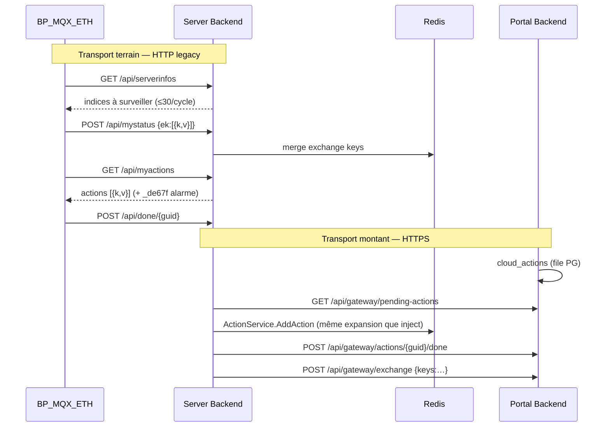

# Gateway Exchange

> Synthèse racine — détail API dans `wiki/concepts/gateway-exchange.md` et [[Table D Echange]].

La **gateway exchange** désigne l'ensemble des mécanismes par lesquels la [[Essensys Raspberry Gateway]] maintient et synchronise la **table d'échange** domotique entre l'armoire ([[Essensys Board SC944D]] / [[Client Essensys Legacy]]), le cache local ([[Essensys Redis]]) et le hub cloud ([[Essensys User Portal Backend]]).

## Rôle de la table d'échange

- **Contrat central** : paires **k** (indice absolu) / **v** (octet 0–255 ou masque de bits).
- **Côté firmware** : enum `Tbb_Donnees_Index` + tableau `Tb_Echange[]` — voir `raw/protocol/TableEchange.h` (SC944D 099-37).
- **Côté gateway** : merge Redis + expansion ordres ([[Essensys Server Backend]] `ActionService`, `internal/scenario/`).
- **Côté cloud** : cache `gateway_exchange_cache` + inject portail — voir [[Essensys User Portal Backend]].

Sources : `wiki/concepts/table-d-echange.md`, `essensys-server-backend/pkg/protocol/constants.go`.

## Structure `TableEchange.h`

### Enum principale `Tbb_Donnees_Index`

Indices absolus dans le tableau d'échange (extrait documenté) :

| Zone | Indices (exemples) | Sémantique |
|------|-------------------|------------|
| Version / horloge | début enum | Versions soft, date/heure BP |
| Planning chauffage | 13–348 (profils sync) | 84 octets / zone |
| Modes immédiats | 349–352 | Chauffage instantané |
| Alarme | 409–411 | État / contrôle |
| Temps volets | 566–589 | Course en secondes |
| **Scenario** (trigger) | **590** | `0` aucun ; `1` serveur ; `2`–`8` slot mémorisé |
| Dernier lancé | **591** | Slot exécuté (lecture UI) |
| **Scenario1–8** | **592–919** | 8 × `Scenario_NB_VALEURS` (41 octets) — voir [[Scénarios domotique]] |
| État BP | après Scenario8 | Bits alarme, etc. |

Définition slots scénario (firmware) :

```c
// raw/protocol/TableEchange.h (extrait)
Scenario = …;              // indice 590 — numéro scénario à lancer
Scenario_DernierLance,     // indice 591
Scenario1,                 // indice 592 — réservé serveur (Mode B)
Scenario2 = Scenario1 + Scenario_NB_VALEURS,  // Je sors
// … Scenario8
```

### Enum `enumScenario` (41 champs / slot)

Champs logiques par slot : alarme, masques **éteindre/allumer** lumières PDV/CHB/PDE, volets, sécurité, machines, consignes chauffage, cumulus, réveil (`Scenario_NB_VALEURS`).

Constantes Go alignées : `IndexScenario=590`, `IndexLightStart=605`, `IndexLightEnd=622` — `raw/protocol/constants.go`.

> [!todo] Documenter dans le wiki la taille exacte totale du tableau `Tb_Echange[]` (dernier indice `Tbb_Donnees_Index`) — le header couvre ~920+ indices mais la borne max Go est `MaxExchangeIndex=999` sans tableau complet exporté dans `raw/`.

## Dual protocol — deux transports

### Transport terrain (firmware ↔ gateway)

| Aspect | Valeur documentée | Source |
|--------|---------------------|--------|
| Couche | **HTTP/1.1** sur **TCP** | `wiki/concepts/dual-protocol.md` |
| Port | **80** (segment armoire) | `raw/protocol/tcp-single-packet.md` |
| Réseau | CM5 **eth1** `10.0.1.1/24`, DHCP/DNS dnsmasq ; hostname firmware → gateway | `wiki/entities/essensys-raspberry-gateway.md` |
| Contrainte critique | Réponse HTTP **en un seul paquet TCP** | `raw/protocol/tcp-single-packet.md` |
| JSON | Clés **non quotées** côté client ; normalisation serveur | `raw/protocol/architecture-dual-protocol.md` |
| Endpoints figés | `/api/serverinfos`, `/api/mystatus`, `/api/myactions`, `/api/done/{guid}` | `wiki/synthesis/migration-legacy-to-modern.md` |

> [!todo] Le prompt d'architecture mentionne RS485/SPI/LoRa — **non confirmé** pour le dialogue serveur : les sources ESSENSYS décrivent **Ethernet + HTTP** pour BP_MQX_ETH. Le bus **I2C** documenté concerne les cartes auxiliaires **à l'intérieur** de l'armoire, pas le lien vers la gateway.

### Transport montant (gateway ↔ cloud)

| Aspect | Valeur documentée | Source |
|--------|---------------------|--------|
| Couche | **HTTPS** (TLS terminé Traefik/nginx OVH) | `essensys-raspberry-gateway/docs/maintenance/cloud-sync.md` |
| Modèle | **Polling sortant** gateway → hub (NAT traversal) | `wiki/concepts/cloud-relay.md` |
| Actions | `GET /api/gateway/pending-actions` → inject local → `POST …/done` | `wiki/concepts/gateway-exchange.md` |
| État / sync | `POST /api/gateway/exchange`, `GET /api/gateway/sync-config` | idem |
| Auth | `Authorization: Bearer <gateway_token>`, `X-Gateway-ID`, MAC eth0/eth1 | `essensys-ansible/docs/install-gateway.md` |

> [!todo] **MQTT/gRPC/mTLS** entre gateway et cloud : non présent dans les implémentations documentées (`internal/cloudsync/` = client HTTP Go).

## Relais et mapping entre protocoles



Étapes clés :

1. **Inject web/portail** → même pipeline que cloud (`ActionService`, expansion 590+605–622 Mode B).
2. **Pull planifié** — `ExchangePullScheduler` : rotation `serverinfos` ≤30 indices → remplit Redis → push cloud par profil `sync_profiles`.
3. **Exclusion push** — index **590** exclu des push continus (reset firmware) — profil **Scénarios** migration 009.

Sources : `wiki/concepts/gateway-exchange.md`, `openspec/changes/essensys-scenario-management/design.md`.

## Adressage et identité

| Élément | Identifiant | Source |
|---------|-------------|--------|
| Gateway cloud | `gateway_id` (souvent dérivé MAC eth0) | `essensys-ansible/docs/install-gateway.md` |
| Session hub | `gateway_token` (Bearer) | idem |
| Liaison utilisateur | `linked_machine_id`, `linked_gateway_id`, approbation admin | `essensys-raspberry-gateway/docs/acces/portal-remote.md` |
| Filtrage actions | `cloud_actions.machine_id` = `gateway_sessions.machine_id` | idem |
| Client legacy LAN | `client_id` Basic Auth (optionnel) | `wiki/entities/essensys-server-backend.md` |

> [!todo] Schéma d'adressage **multi-gateway / multi-armoire** sur un même site — non documenté dans les sources ingérées.

## API cloud (référence rapide)

| Route | Rôle |
|-------|------|
| `GET /api/gateway/pending-actions` | Actions utilisateur en attente |
| `POST /api/gateway/exchange` | Push snapshot k/v |
| `GET /api/gateway/sync-config` | Profils + runs sync |
| `POST /api/gateway/sync-runs/*` | Exécution sync planifiée |
| `PATCH /api/gateway/sync-profiles/scenarios` | Toggle profil Scénarios |

LAN admin : `/api/admin/heating/sync`, `/api/admin/scenarios/sync`, `/api/scenarios/*` — voir `wiki/concepts/gateway-exchange.md`.

## Sécurité du lien

| Lien | État actuel | Cible / gap |
|------|-------------|-------------|
| eth1 armoire | HTTP clair, réseau isolé | > [!todo] TLS local ou VPN si menace intra-segment |
| eth0 → OVH | HTTPS obligatoire | OK — `hub_url` https:// |
| Identité gateway | Token + MAC en base | > [!todo] Certificat client / rotation automatique token |
| Intégrité ordres | AES alarme uniquement (legacy) | > [!todo] Signature ordres non-alarme |
| Secrets déploiement | Ansible vault, `.env` hors git | `wiki/entities/essensys-ansible.md` |

**Ancrage certificats** : Let's Encrypt WAN (`mon.essensys.fr`) ; CA locale pour `mon.essensys.local` ([[Essensys Traefik]]) — pas de certificat embarqué dans le firmware BP.

## Voir aussi

- [[Cloud Relay]] — vue cas d'usage
- [[Dual Protocol]] — contraintes legacy
- [[Scénarios domotique]] — plage 591–919
- OpenSpec : `essensys-cloud-sync-scheduler`, `essensys-scenario-management`
