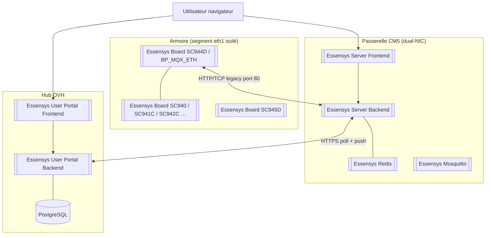

# Platform Overview

> Synthèse racine — détail maintenu dans `wiki/synthesis/platform-overview.md` et les entités liées.

Essensys est une **solution domotique résidentielle** (alarme, chauffage, éclairage, volets, arrosage, cumulus, détection de fuite) basée sur une **armoire cartes** ([[Essensys Board SC944D]] et esclaves), une **passerelle Raspberry CM5** ([[Essensys Raspberry Gateway]]) et un **hub cloud** ([[Essensys User Portal Backend]] sur `mon.essensys.fr`). Le contrat runtime entre ces couches est la [[Table D Echange]] (paires **k/v**, octets 0–255).

## Topologie en couches

Sources : `wiki/entities/essensys-raspberry-gateway.md`, `wiki/entities/client-essensys-legacy.md`, `essensys-raspberry-gateway/docs/acces/portal-remote.md`.

## Composants clés

| Couche | Legacy (référence) | Modern (cible) | Entité wiki |
|--------|-------------------|----------------|-------------|
| Firmware maître | [[Client Essensys Legacy]] BP_MQX_ETH | Inchangé en prod | [[Essensys Board SC944D]] |
| Serveur historique | [[Essensys Web Legacy]] ASP.NET + SQL Server | — | déprécié |
| Passerelle LAN | Boîtier intégré legacy | [[Essensys Server Backend]] + [[Essensys Server Frontend]] | [[Essensys Raspberry Install]] |
| Bus local optionnel | — | [[Essensys Mosquitto]] (ex. [[Essensys Homeassitant]]) | LAN only |
| Cloud | SQL + polling legacy | [[Essensys User Portal Backend]] `CONSOLIDATED_MODE` | [[Essensys Support Site]] → consolidé |
| Déploiement | — | [[Essensys Ansible]] / NixOS ([[Essensys Gateway Nixos]]) | CM5 dual-NIC |

## Stack technique par couche

| Lien | Protocole / transport documenté | Source |
|------|----------------------------------|--------|
| Cartes esclaves ↔ SC944D | Bus **I2C** (cartes auxiliaires) | `wiki/entities/client-essensys-legacy.md` |
| BP_MQX_ETH ↔ gateway | **HTTP/1.1** sur **TCP/IP** port **80**, polling (`serverinfos` ~20 s, `mystatus`/`myactions` ~1–2 s) | `raw/protocol/tcp-single-packet.md`, `wiki/concepts/dual-protocol.md` |
| Gateway ↔ utilisateur LAN | **HTTPS** via [[Essensys Traefik]] / [[Essensys Nginx]] | `wiki/entities/essensys-raspberry-gateway.md` |
| Gateway ↔ cloud | **HTTPS** sortant (eth0), agent `internal/cloudsync/` | `wiki/concepts/gateway-exchange.md`, `essensys-raspberry-gateway/docs/maintenance/cloud-sync.md` |
| Portail ↔ hub | REST/JSON, JWT (support-site / portail) | `wiki/entities/essensys-user-portal-frontend.md` |
| Intégration HA (option) | **MQTT** broker local | `wiki/entities/essensys-mosquitto.md` |

> [!todo] Préciser si un transport **MQTT ou gRPC** est prévu entre gateway et cloud — les sources actuelles décrivent uniquement **HTTPS + polling** pour [[Cloud Relay]] / [[Gateway Exchange]], pas MQTT WAN.

## Flux de données end-to-end

1. **Capteur / action locale** — relais, fil pilote, TeleInfo Linky (UART) → table firmware `Tbb_Donnees_Index` / `Tb_Echange` (`raw/protocol/TableEchange.h`).
2. **Remontée état** — `POST /api/mystatus` avec `{ek:[{k,v},…]}` ([[Dual Protocol]]).
3. **Commande** — UI LAN (`POST /api/admin/inject`) ou portail (`POST /api/portal/inject`) → Redis → `GET /api/myactions` → firmware → `POST /api/done/{guid}`.
4. **Sync cloud** — profils PostgreSQL `sync_profiles` → pull armoire → `POST /api/gateway/exchange` ([[Gateway Exchange]], [[Scénarios domotique]] 591–919).
5. **Pilotage distant** — [[Cloud Relay]] : `cloud_actions` en file → gateway poll `GET /api/gateway/pending-actions`.

## Concepts transverses

- [[Dual Protocol]] — legacy IoT vs REST moderne sur le même backend Go
- [[Table D Echange]] — contrat k/v (indices absolus, ex. 590, 605–622, 591–919 scénarios)
- [[Cloud Relay]] — cas d'usage utilisateur NAT traversal
- [[Gateway Exchange]] — contrat API technique gateway ↔ hub
- [[Migration Legacy To Modern]] — état de la bascule ASP.NET/MQX → Go/React/PostgreSQL
- [[Scénarios domotique]] — slots mémorisés firmware (juin 2026)

## Sécurité (état documenté)

| Lien | Chiffrement | Authentification | Stockage secrets | Source |
|------|-------------|------------------|------------------|--------|
| BP ↔ gateway (eth1) | **HTTP clair** (segment isolé `10.0.1.0/24`) | Basic Auth optionnelle | EEPROM / config firmware | `wiki/entities/client-essensys-legacy.md` |
| LAN utilisateur | **HTTPS** (Traefik LE ou CA locale `.local`) | Basic Auth WAN / session web | `users.htpasswd`, Ansible vault | `wiki/entities/essensys-traefik.md`, `wiki/entities/essensys-ansible.md` |
| Gateway ↔ cloud | **HTTPS obligatoire** (`hub_url` https://) | Bearer `gateway_token` + headers `X-Gateway-Eth0-MAC` / `Eth1-MAC` | PostgreSQL `gateway_sessions`, Ansible vault | `wiki/concepts/gateway-exchange.md`, `essensys-ansible/docs/install-gateway.md` |
| Portail utilisateur | HTTPS | JWT (support-site) | `JWT_SECRET` partagé portail/support | `wiki/entities/essensys-user-portal-backend.md` |
| Ordres alarme | AES propriétaire (legacy) | Clé machine `Pkey` | — | `wiki/concepts/table-d-echange.md` |

> [!todo] **mTLS** gateway ↔ cloud : non documenté dans le code actuel — authentification par token + MAC uniquement.
> [!todo] **Certificat d'identité matérielle** (TPM / certificat client gateway) : non implémenté ; ancrage identité = **triplet MAC + gateway_id + token** enregistré côté OVH.
> [!todo] Rotation coordonnée `JWT_SECRET` / `ADMIN_TOKEN` entre support-site et portail consolidé.

## Migration legacy → modern

État synthétique ([[Migration Legacy To Modern]]) :

- **Fait** : protocole legacy IoT sur [[Essensys Server Backend]], UI React LAN + portail, [[Gateway Exchange]] / cloudsync, profils sync (chauffage, volets, scénarios).
- **En cours** : parité jumeaux frontends, consolidation support-site → portail, production CM5 (Ansible vs NixOS).
- **Règle absolue** : ne pas modifier `/api/serverinfos`, `/api/mystatus`, `/api/myactions`, `/api/done/{guid}` ni les contraintes single-packet TCP.

## Voir aussi

- [[Index]] — catalogue wiki
- [[Roadmap OpenSpec]] — changes actifs
- `raw/architecture/README.md` — index 40 dépôts
