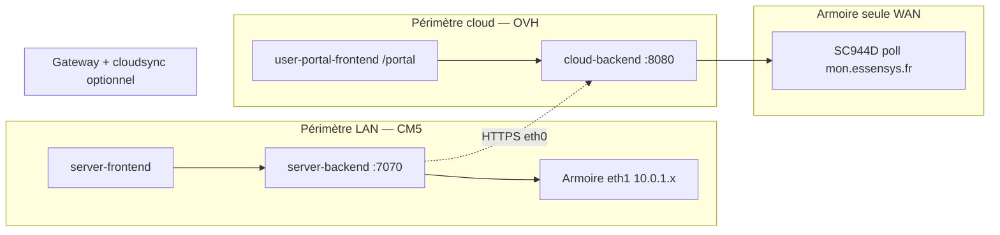

# Définition

Un **périmètre de déploiement** est l'ensemble {hôte cible, dépôts applicatifs, playbook ou script, URL utilisateur} pour une surface Essensys. Confondre deux périmètres (ex. pousser `essensys-user-portal-frontend` sur la CM5, ou `essensys-server-backend` sur OVH) est une erreur fréquente : les **jumeaux** LAN/cloud partagent la logique métier mais pas les binaires ni les chemins de deploy.

# Vue d'ensemble



# Tableau récapitulatif

| Périmètre | Hôte | URL typique | Backend | Frontend | Inventaire Ansible |
|-----------|------|-------------|---------|----------|-------------------|
| **Gateway CM5 (LAN)** | Raspberry CM5 sur site | `https://mon.essensys.local/dashboard` | `essensys-server-backend` | `essensys-server-frontend` | `inventory.gateway` |
| **Hub cloud OVH** | VPS Ubuntu | `https://mon.essensys.fr/portal/` | `essensys-user-portal-backend` (service `essensys-cloud-backend`) | `essensys-user-portal-frontend` | `inventory` (groupe `essensys`) |
| **Armoire seule (WAN)** | Aucun backend local — firmware → OVH | Même hub cloud ; UI portail | Idem hub OVH (`/api/myactions`, `/api/mystatus`) | Idem portail | Liaison admin + poll firmware |
| **Site support / admin** | OVH | `https://mon.essensys.fr/` (admin) | Inclus dans hub consolidé | `essensys-support-site` | `support-site.yml` |
| **Démos & sites publics** | OVH | `demo.essensys.fr`, `demo.portal.essensys.fr`, `roadmap.essensys.fr`, `docs.essensys.fr` | Mock ou hub selon surface | Builds dédiés | `deploy-roadmap-site.yml`, scripts sync |

# Périmètre 1 — Gateway CM5 (LAN)

**Rôle :** domotique locale, firmware en HTTP sur le segment armoire (eth1), HTTPS LAN sur eth0.

| Élément | Valeur |
|---------|--------|
| Playbook install | `essensys-ansible/install.gateway.yml` |
| Playbook update | `essensys-ansible/update.raspberrypi.yml` avec `-i inventory.gateway` |
| Inventaire | `essensys-ansible/inventory.gateway` (`ansible_host` ex. `192.168.0.14`, user `essensys`) |
| Binaire backend | `/opt/essensys/backend/server` (conteneur `essensys-backend`, port **7070**) |
| Static frontend | `/opt/data/frontend/` |
| Compose | `/opt/data/docker-compose.yml` |
| Doc | `essensys-ansible/docs/install-gateway.md` |

**Deploy rapide dev (rsync, sans push GitHub) :**

```bash
# Backend
rsync -az --exclude .git --exclude node_modules \
  essensys-server-backend/ essensys@192.168.0.14:~/essensys-server-backend/
ssh essensys@192.168.0.14 'cd ~/essensys-server-backend && \
  PATH=/usr/local/go/bin:$PATH go build -o /opt/essensys/backend/server ./cmd/server && \
  docker restart essensys-backend'

# Frontend (build local → push dist)
cd essensys-server-frontend && npm run build
rsync -az --delete dist/ essensys@192.168.0.14:/opt/data/frontend/
```

Script tout-en-un (OVH + CM5) : `essensys-ansible/scripts/deploy-scenarios-local.sh` (étapes 4–6 = CM5).

**Observabilité :** Prometheus local `:9092`, control-plane `/controle_plane` — pas New Relic (réservé OVH).

# Périmètre 2 — Hub cloud OVH (portail distant)

**Rôle :** portail utilisateur `/portal/`, API `/api/portal/*`, protocole legacy IoT WAN (`/api/serverinfos`, `/api/mystatus`, `/api/myactions`, `/api/done`).

| Élément | Valeur |
|---------|--------|
| Playbook stack portail | `essensys-ansible/deploy-portal-stack.yml` |
| Playbook complet | `essensys-ansible/support-site.yml` (hub consolidé + support + portal static) |
| Inventaire | `essensys-ansible/inventory` → `test.essensys.fr` / prod `mon.essensys.fr` |
| Service backend | `essensys-cloud-backend` → `/opt/essensys/cloud-backend/cloud-server` (**:8080**) |
| Static portail | `/opt/essensys/portal-frontend/dist/` |
| Secrets | SOPS `essensys-ansible/secrets/cloud/essensys.sops.yaml` (`SOPS_AGE_KEY_FILE`) |

**Deploy rapide dev (rsync) :**

```bash
# Backend
rsync -az --exclude .git essensys-user-portal-backend/ ubuntu@test.essensys.fr:/tmp/cloud-backend-src/
# … build + systemctl restart essensys-cloud-backend (voir deploy-scenarios-local.sh §1–2)

# Frontend portail
rsync -az --exclude .git --exclude node_modules --exclude dist \
  essensys-user-portal-frontend/ ubuntu@test.essensys.fr:/tmp/portal-frontend-src/
# … npm run build → /opt/essensys/portal-frontend/dist/
```

**Observabilité :** New Relic EU — `https://one.eu.newrelic.com/` (APM `essensys-cloud-backend`, Browser `essensys-user-portal-frontend`).

**Optimisation file cloud (2026-06) :** fusion des `cloud_actions` `pending` multiples en une seule livraison `myactions` (dernière valeur gagne par indice k) — voir `essensys-user-portal-backend/internal/domain/merge_params.go`.

# Périmètre 3 — Armoire seule (WAN, sans gateway)

**Rôle :** l'armoire SC944D poll directement `mon.essensys.fr` ; pas de `essensys-server-backend` sur site.

| Élément | Détail |
|---------|--------|
| Firmware | Cycle ~2 s : `serverinfos` → `mystatus` (201 obligatoire) → `myactions` → `/done` |
| Hub | `essensys-user-portal-backend` / legacy IoT handlers |
| Liaison | Admin support-site : user ↔ machine (`linked_machine_id`, `machines.id` stable) |
| Latence typique | ~3–6 s si poll OK ; ~10–15 s si cycle raté ou mauvais timing |
| Deploy | **Uniquement périmètre 2** (OVH) — pas de deploy CM5 |

Ne pas confondre avec le périmètre 1 : l'UI `server-frontend` sur CM5 ne sert pas l'utilisateur en mode armoire seule.

# Périmètre 4 — Sites publics & démos

| Surface | Dépôt | Deploy |
|---------|-------|--------|
| Support + admin | `essensys-support-site` | `support-site.yml` |
| Démo dashboard local | sync `server-frontend` → support dist | `essensys-support-site/scripts/sync-demo-server-frontend.sh` |
| Démo portail mock | `user-portal-frontend` mode démo | `sync-demo-portal-frontend.sh`, `deploy-roadmap-site.yml` |
| Roadmap publique | `essensys-memory` | `deploy-roadmap-site.yml`, `publish-roadmap-public.sh` |
| Documentation | `essensys-doc` | `deploy-docs-site.yml` |

# Jumeaux à synchroniser (logique, pas deploy croisé)

| Domaine | LAN (CM5) | Cloud (OVH) |
|---------|-------------|-------------|
| UI domotique | `essensys-server-frontend` | `essensys-user-portal-frontend` |
| Backend métier | `essensys-server-backend` | `essensys-user-portal-backend` |
| Règle | `.cursor/rules/portal-server-frontend-sync.mdc` | idem |
| Règle | `.cursor/rules/portal-server-backend-sync.mdc` | idem |

Après changement **server-frontend** : regénérer la démo (`sync-demo-server-frontend.sh`). Après changement **protocol / inject / indices k/v** : reporter dans les deux backends et mettre à jour le brain si OpenSpec ou table d'échange.

# Checklist « où je deploy ? »

1. **Je touche l'UI éclairage/scénarios** → deploy **deux frontends** (CM5 rsync + OVH rsync) si les deux surfaces sont actives.
2. **Je touche inject / myactions / cloud_actions** → deploy **user-portal-backend** (OVH) ; reporter logique dans **server-backend** si parité LAN.
3. **Je touche nginx / TLS / postgres OVH** → Ansible `support-site.yml` ou playbook ciblé.
4. **Je touche firmware SC944D** → flash armoire ; doc brain ; **pas** de deploy Ansible applicatif.
5. **Brain / OKF** → `essensys-memory/okf/` + scripts sync brain si change OpenSpec clôturé.
6. **Je touche LAN IAM / trusted devices** → deploy **server-backend** + **server-frontend** (`VITE_LAN_IAM=true`) sur CM5 ; migrations `003`–`005` via `lan_iam_migrations.yml`. Voir [Trusted Devices LAN](/concepts/trusted-devices-lan.md).

# Code pointers

* `essensys-ansible/install.gateway.yml` — install CM5
* `essensys-ansible/update.raspberrypi.yml` — update CM5 / Pi
* `essensys-ansible/deploy-portal-stack.yml` — hub + SPA portail OVH
* `essensys-ansible/support-site.yml` — stack OVH complète
* `essensys-ansible/scripts/deploy-scenarios-local.sh` — rsync dev OVH + CM5
* `essensys-ansible/docs/install-gateway.md` — guide CM5
* `essensys-ansible/docs/playbooks.md` — index playbooks
* `essensys-ansible/docs/cloud-backend-migration.md` — hub consolidé `:8080`
* `essensys-user-portal-backend/scripts/measure-action-latency.sh` — métriques latence armoire seule

# Liens

* [LAN Local Portal](/portals/lan-local-portal.md)
* [Trusted Devices LAN](/concepts/trusted-devices-lan.md)
* [Cloud User Portal](/portals/cloud-user-portal.md)
* [Gateway Install Control](/portals/gateway-install-control.md)
* [Essensys Ansible](/systems/essensys-ansible.md)
* [Dual Protocol](/protocols/dual-protocol.md)
* [Armoire Architecture](/synthesis/armoire-architecture.md)
* [Feature Lifecycle](/processes/feature-lifecycle.md)

# Citations

[1] [Essensys Ansible](/systems/essensys-ansible.md)
[2] [Essensys Raspberry Install](/systems/essensys-raspberry-install.md)
[3] [Platform overview](/synthesis/platform-overview.md)
