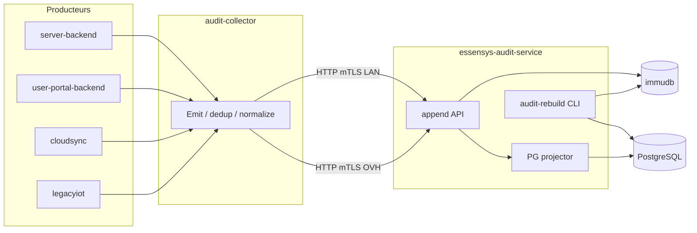
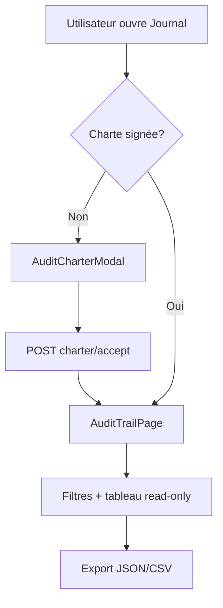
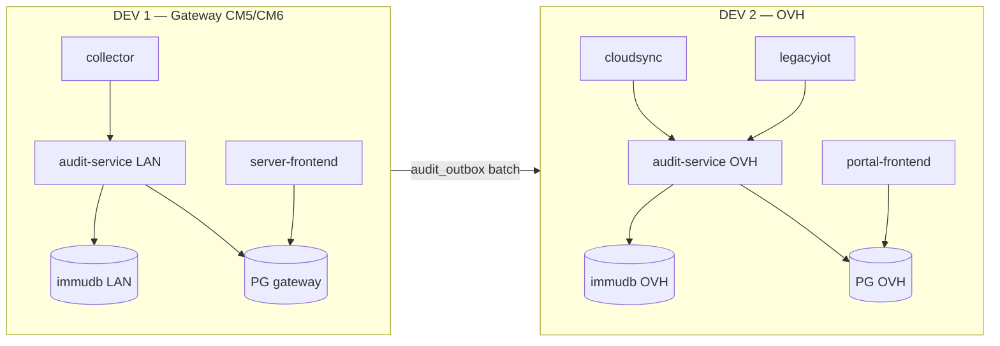

## Context

Essensys dispose aujourd'hui de trois mécanismes d'audit distincts qui ne couvrent pas le besoin domotique par armoire :

| Mécanisme | Périmètre | Limite |
|-----------|-----------|--------|
| `audit_logs` (OVH, identity consolidée) | Login, rôles, admin plateforme | Pas d'événements domotique |
| `portal_audit_log` (001_init) | Actions portail legacy | Schéma minimal, pas lié `machine_id` |
| Control-plane `/api/audit` | Ops Redis gateway | Hors scope utilisateur |

Le prompt `prompts/essensys-armoire-audit-trail.md` et l'autocritique OKF (§0 bis) définissent trois **périmètres de déploiement** ([[Deployment Perimeters]]) avec des chemins d'écriture/lecture différents :

1. **CM5 / Pi LAN** — `essensys-server-backend` + sync OVH
2. **Hub + cloudsync** — + writers `essensys-user-portal-backend` sur inject cloud
3. **Armoire seule WAN** — firmware → `internal/legacyiot` OVH, pas de gateway locale

**Contraintes :** dual protocol (pas de modification wire legacy), jumeaux server ↔ portal, PostgreSQL gateway déjà utilisé pour [[LAN IAM]].

## Goals / Non-Goals

**Goals:**

- Journal append-only **`armoire_audit_events`** sur PostgreSQL OVH, clé métier `machine_id` — **modèle de lecture** reconstruisible.
- **immudb** comme **source de vérité immuable** : preuve cryptographique (Merkle), détection de falsification, vérification d'intégrité, audit réglementaire.
- **Double écriture obligatoire** : toute persistance audit passe par **`essensys-audit-service`** → immudb ; projection asynchrone vers PostgreSQL.
- **`essensys-audit-collector`** : point d'entrée unique pour tous les services producteurs (inject, IAM, exchange, legacyiot, cloudsync).
- **`essensys-audit-service`** sur gateway LAN (et instance OVH) : seul composant autorisé à écrire immudb.
- Lecture read-only IHM + API GET pour rôles autorisés ; écriture **services uniquement** (via collector → audit-service).
- RBAC : `user` / `admin_local` / `admin_global` (cloud) et `lan_user` / `lan_admin` (LAN) ; exclusion `guest_*` / `lan_guest`.
- Déduplication `STATE_CHANGE` sur whitelist d'indices table d'échange.
- Outbox PG gateway + sync idempotent ; lecture LAN depuis cache local si WAN coupé.
- Hash chain SHA-256 à l'ingest (immudb + colonnes PG miroir) ; triggers anti UPDATE/DELETE sur PG.
- CLI **`audit-rebuild`** : reconstruction PostgreSQL depuis immudb (OVH et gateway).
- Tests ≥ 85 % sur `internal/audit/*` + audit-service.
- **UI utilisateur intégrée** : sidebar, Paramètres, Dashboard → `/settings/audit` (jumeaux).

**Non-Goals:**

- Fusion des tables `audit_logs` / `portal_audit_log` en MVP.
- Purge/édition d'événements par admin via IHM (immudb reste append-only ; purge PG opérationnelle uniquement).
- WORM datacenter tiers (S3 Object Lock) — immudb couvre le besoin MVP.
- Audit TCP firmware brut.
- Lien IHM audit ↔ control-plane Redis.

## Decisions

### D1 — immudb source de vérité ; PostgreSQL modèle de lecture

**Choix :** toute écriture audit est **d'abord** appendée dans **immudb** via `essensys-audit-service`. PostgreSQL (`armoire_audit_events`, `audit_outbox`) est une **projection** queryable, reconstruisible par `audit-rebuild`.

**Clé immudb :** `armoire/{machine_id}/event/{event_id}` — valeur JSON canonique (enveloppe événement + `prev_hash` / `event_hash`).

**Alternatives :** PostgreSQL seul avec hash chain — rejeté (pas de preuve cryptographique native, falsification DB possible sans détection externe).

**Objectifs couverts :**

| Objectif | Mécanisme immudb |
|----------|------------------|
| Données immuables | Append-only, pas de UPDATE/DELETE |
| Preuve cryptographique | Merkle tree + `VerifiedGet` / `VerifiedTx` |
| Détection falsification | `audit-verify` compare PG vs immudb |
| Vérification d'intégrité | CLI + endpoint admin `GET /api/admin/audit/integrity` |
| Audit réglementaire | Export signé + horodatage immuable |

### D2 — Table canonique séparée `armoire_audit_events` (projection PG)

**Choix :** nouvelle table OVH, coexistence documentée avec `audit_logs` et `portal_audit_log`.

**Alternatives :** étendre `audit_logs` — rejeté (schéma user-centric, filtre `UserID` incompatible avec « journal foyer complet »).

### D3 — RBAC : `user` voit tout le journal de son armoire liée

**Choix :** transparence foyer + détection intrusion ; **BREAKING** vs `audit_trail.md` support.

**Alternatives :** filtre par `actor_id` — rejeté pour le cas d'usage « qui a éteint le chauffage ? ».

**Résolution `machine_id` :** `linked_machine_id` ?? `linked_armoire_id` (mode armoire seule WAN).

### D4 — `essensys-audit-service` (service AUDIT SQL)

**Choix :** binaire Go dédié (`cmd/audit-service`) déployé :

| Instance | Hôte | immudb | PG cible |
|----------|------|--------|----------|
| **LAN** | Gateway CM5/Pi (Docker Compose) | `immudb` conteneur local `:3322` | PG gateway (`audit_outbox` + projection locale) |
| **Cloud** | OVH VPS (systemd ou Docker) | `immudb` OVH `:3322` | PostgreSQL OVH `armoire_audit_events` |

**API interne (réseau local / mTLS) :**

- `POST /v1/audit/append` — un événement (idempotent `event_id`)
- `POST /v1/audit/batch` — lot gateway sync
- `GET /v1/audit/health` — immudb + PG projection lag

**Règle :** aucun autre service ne parle directement à immudb ; credentials immudb réservés à `audit-service`.

### D5 — `essensys-audit-collector` (collecte inter-services)

**Choix :** package Go `github.com/essensys-hub/essensys-audit-collector` (client léger) embarqué dans chaque producteur.

**Producteurs instrumentés :**

| Service | Événements collectés |
|---------|---------------------|
| `essensys-server-backend` | inject LAN, actions, IAM login/logout, trusted devices, delta exchange |
| `essensys-user-portal-backend` | inject cloud, legacyiot delta, ingest gateway relay |
| `cloudsync` (agent gateway) | flush outbox, erreurs sync |
| Futurs services | hook `collector.Emit(ctx, AuditEvent)` |

**Flux :** producteur → `collector.Emit` (normalisation, dedup STATE_CHANGE) → HTTP/gRPC vers `audit-service` local (LAN) ou OVH (cloud / relay).

**Alternatives :** chaque backend écrit PG directement — rejeté (pas de point unique immudb, risque d'oubli writer).

### D6 — Outbox PostgreSQL gateway (buffer + projection)

**Choix :** table `audit_outbox` dans la même instance PG que `lan_users` (migration `006+`). Si `audit-service` ou immudb LAN indisponible, le collector bufferise dans `audit_outbox` ; replay idempotent au retour.

**Alternatives :** SQLite dédié — rejeté (OKF E4, double persistance).

### D7 — Writers et anti-doublon cloud relay

| Origine action | Writer responsable |
|----------------|------------------|
| Inject cloud (`POST /api/portal/inject`) | `user-portal-backend` → **collector** → audit-service OVH |
| Inject LAN (`POST /api/admin/inject`) | `server-backend` → **collector** → audit-service LAN |
| Exécution gateway après poll cloud | **ne pas** ré-logger `USER_ACTION` si `action_guid` déjà présent |
| Sync gateway → OVH | `cloudsync` → collector OVH (batch) après immudb LAN confirmé |

### D8 — Déduplication états : whitelist indices

**Choix :** hook delta sur indices « auditables » uniquement (alarme, chauffage, scénario actif, portes, cumulus, etc.) — liste figée dans `internal/audit/whitelist.go` + doc brain.

**Alternatives :** tous les indices `mystatus` — rejeté (bruit, charge INSERT).

Normalisation : comparer valeurs canonisées (trim, zéros en tête numériques).

### D9 — Hash chain (immudb + projection PG)

**Choix :** `audit-service` calcule `prev_hash` / `event_hash` (SHA-256) par `machine_id` à l'append immudb ; mêmes colonnes recopiées en projection PG pour requêtes SQL.

### D10 — Lecture LAN vs cloud

| Surface | Source lecture |
|---------|----------------|
| Cloud `GET /api/portal/audit/events` | OVH `armoire_audit_events` |
| LAN `GET /api/audit/events` | Union : events PG gateway répliqués + outbox `pending` (marqués `pending_sync: true`) |

### D11 — Sécurité API et DB

- Middleware Go `internal/audit/Authorizer` partagé (copie logique dans les deux backends, tests miroirs).
- PostgreSQL RLS : rôle `audit_ingest` INSERT only ; SELECT policies par membership.
- Routes utilisateur : **GET uniquement** sous `/api/audit` et `/api/portal/audit`.
- IHM : garde routes React + table sans cellules éditables ; CASL optionnel si tests abilities équivalents.

### D16 — Reconstruction PostgreSQL depuis immudb

**Choix :** commande `audit-rebuild` (intégrée à `essensys-audit-service`) :

```bash
audit-rebuild --source immudb --target postgres --machine-id M [--dry-run]
```

1. Scan immudb `armoire/{machine_id}/event/*` par ordre transaction.
2. Vérification Merkle (`VerifiedGet` par clé).
3. `TRUNCATE` + `INSERT` projection `armoire_audit_events` (OVH) ou tables locales gateway.
4. Rapport : lignes reconstruites, divergences détectées, `event_hash` invalides.

**Cas d'usage :** corruption PG, migration ratée, restauration DR, audit réglementaire « preuve vs copie ».

**Rétention :** purge job (`audit_retention_purge`) n'affecte **que** PostgreSQL ; immudb conserve l'historique complet (audit réglementaire). Export légal depuis immudb.

### D17 — Vérification d'intégrité périodique

Job cron `audit-integrity-check` (OVH + gateway) :

- Compare échantillon ou intégralité PG ↔ immudb.
- Émet `SECURITY_ALERT` + métrique Prometheus `audit_integrity_mismatch_total`.
- Endpoint admin : `GET /api/admin/audit/integrity?machine_id=M`.

### D19 — Déploiement immudb (Ansible)

| Cible | Rôle Ansible | Port | Persistance |
|-------|--------------|------|-------------|
| OVH | `roles/immudb_cloud` | 3322 (localhost) | volume `/opt/essensys/immudb` |
| Gateway | `roles/immudb_gateway` | 3322 (réseau Docker interne) | volume NVMe gateway |

Secrets : `immudb` admin + `audit_service` user via SOPS. Pas d'exposition WAN du port 3322.

### D20 — Architecture globale (écriture)



### D18 — Intégration UI utilisateur (jumeaux + parcours)

**Principe :** le journal d'audit est une **fonctionnalité utilisateur** (pas admin support-site), au même niveau que « Mon compte » — pas une page cachée.

#### Navigation

| Emplacement | Comportement |
|-------------|--------------|
| **Sidebar** | Entrée **« Journal d'activité »** (`ClipboardDocumentListIcon`) → `/settings/audit` — visible si rôle lecteur autorisé **et** armoire liée (cloud) ou session LAN (`lan_user` / `lan_admin`) |
| **Paramètres** | `ControlCard` « Journal d'activité domotique » avec résumé (dernier événement, statut charte, badge sync) + lien « Consulter » |
| **Dashboard** | `CardSummary` optionnel « Journal d'activité » (même pattern que carte Paramètres) — accès rapide utilisateur |

**Pattern existant à suivre :** `SidebarMenu` + `useAdminNavItems` (LAN) ; miroir portail avec hook `useAuditNavItems()` basé sur JWT / `linked_machine_id`.

#### Routes & fichiers (jumeaux)

```
src/pages/AuditTrailPage.tsx
src/components/Audit/AuditEventTable.tsx      # lecture seule
src/components/Audit/AuditFiltersBar.tsx      # date, type, acteur, recherche
src/components/Audit/AuditCharterModal.tsx    # charte RGPD bloquante
src/components/Audit/AuditEventDetailDrawer.tsx
src/hooks/useAuditTrail.ts
src/hooks/useAuditCharter.ts
src/api/auditApi.ts
```

`App.tsx` : `<Route path="/settings/audit" element={<AuditTrailPage />} />`

#### Parcours utilisateur



#### États UI

| État | Affichage |
|------|-----------|
| Non lié / guest | Entrée menu masquée ; redirect `/dashboard` si URL directe |
| Charte requise | Modal plein écran ; pas de tableau derrière |
| `pending_sync` (LAN) | Badge ambre « En attente de synchronisation cloud » sur lignes concernées |
| Liste vide | Message « Aucune activité enregistrée » + lien charte / privacy |
| Erreur 403 | « Accès refusé » sans fuite de données |

#### Différences LAN vs cloud

| | LAN `server-frontend` | Cloud `user-portal-frontend` |
|--|----------------------|------------------------------|
| Auth | Cookie `useLanAuth` | JWT portail |
| API | `/api/audit/events` | `/api/portal/audit/events` |
| Offline | Bandeau « mode local » si events pending | N/A |
| Charte | `lan_audit_charter_acceptances` | `user_audit_charter_acceptances` |

**Hors scope MVP :** onglet audit dans `essensys-support-site/Profile.jsx` (auth www) — lien vers `mon.essensys.fr` suffit en Phase 0 doc.

### D21 — Console admin audit & immudb (distincte du journal utilisateur)

**Principe :** deux surfaces UX séparées — le journal **utilisateur** (recherche foyer, lecture seule) et la **console admin** (santé services, intégrité, rebuild PG, preuve Merkle). Pas de mélange des rôles sur une même page.

#### Routes admin

| Surface | Route | Rôles |
|---------|-------|-------|
| Cloud `essensys-support-site` / portail admin | `/admin/audit` | `admin_global` |
| LAN gateway | `/settings/audit-admin` | `lan_admin` uniquement |

#### Console admin — zones fonctionnelles

| Zone | Contenu |
|------|---------|
| **Santé services** | immudb, `audit-service`, projection PG, cloudsync — état, latence, lag |
| **Intégrité** | tableau PG ↔ immudb par `machine_id` ; bouton « Vérifier » ; alertes mismatch |
| **Rebuild** | sélecteur armoire, dry-run, `audit-rebuild` — reconstruction PG depuis immudb |
| **Preuve réglementaire** | export bundle Merkle (`GET /api/admin/audit/proof`) |
| **RGPD** | registre acceptations charte par utilisateur |
| **Logs** | dernières lignes `audit-service` (collapsible) |

#### Journal utilisateur — recherche avancée (D18 complément)

| Contrôle | Comportement |
|----------|--------------|
| Recherche plein texte | `q` sur acteur, sujet, détail, `subject_key` |
| Filtres | `event_type`, acteur, plage date (presets + custom) |
| Tableau | colonnes heure / type / acteur / sujet / détail / sync ; badge `pending_sync` |
| Panneau détail | drawer droit : hash immudb, IP masquée, transition old→new |
| Graphique | activité 7 jours (actions / états / alertes) |
| Export | JSON / CSV (droit d'accès RGPD) |

#### Composants admin (nouveaux)

```
src/pages/AuditAdminPage.tsx
src/components/AuditAdmin/AuditServiceHealth.tsx
src/components/AuditAdmin/AuditIntegrityPanel.tsx
src/components/AuditAdmin/AuditRebuildPanel.tsx
src/components/AuditAdmin/AuditProofExport.tsx
src/components/AuditAdmin/AuditCharterRegistry.tsx
```

Maquette UX : `canvases/audit-trail-ux-proposal.canvas.tsx`

### D12 — Périmètre armoire seule WAN

Writers dans `internal/legacyiot` → **collector** → audit-service **OVH uniquement** (pas d'immudb gateway) ; pas d'outbox gateway ; **UI portail cloud uniquement**.

### D13 — Rétention et conformité RGPD

**Base légale principale :** intérêt légitime (sécurité du foyer, preuve d'action, détection d'intrusion) + exécution du contrat de service domotique. La charte informe l'utilisateur et recueille son **accord explicite** pour la lecture du journal partagé au sein du foyer.

| Mesure | MVP | Phase 2 |
|--------|-----|---------|
| Rétention PG | 24 mois puis purge projection | Config par armoire |
| Rétention immudb | **Illimitée** (preuve réglementaire) | Archivage froid export |
| IP | Stockée ; affichage masqué `/24` en IHM | Opt-out stockage IP complet |
| Export | JSON/CSV journal armoire (droit d'accès) | Portabilité bundle complet |
| Suppression compte | Anonymisation `actor_id` dans audit existant | Job DPO |

### D14 — Charte utilisateur à signer

**Choix :** document court « Charte — journal d'audit domotique Essensys » (PDF + page web), versionnée (`audit_charter_version`).

**Moments de signature :**
1. **Cloud** — à l'approbation de liaison armoire **ou** au premier `GET /api/portal/audit/events` (modal bloquante).
2. **LAN** — au premier accès `/settings/audit` pour `lan_user` / `lan_admin` (session locale).

**Contenu obligatoire de la charte :**
- Données collectées (actions, états, IP, horodatage, identité compte)
- Finalités (sécurité, transparence foyer, support)
- Durée de conservation (24 mois)
- Destinataires (membres du foyer liés à l'armoire, admins Essensys)
- Droits RGPD (accès, rectification profil, opposition limitée, portabilité, contact DPO)
- Hébergement OVH (UE) + sync gateway

**Stockage :** table `user_audit_charter_acceptances` (OVH) + `lan_audit_charter_acceptances` (PG gateway).

### D15 — Features RGPD proposées (roadmap intégrée au change)

| # | Feature | Description |
|---|---------|-------------|
| F1 | **Charte signée** | Modal + case à cocher + bouton « J'accepte » ; horodatage + version + IP |
| F2 | **Registre consentements** | API admin : qui a signé quelle version, quand |
| F3 | **Ré-consentement** | Si `audit_charter_version` bump → re-signature avant accès audit |
| F4 | **Export droit d'accès** | `GET /api/portal/audit/export` et miroir LAN (JSON/CSV, plage date) |
| F5 | **Purge rétention** | Job cron `audit_retention_purge` (> 24 mois) |
| F6 | **Minimisation IP** | Masquage `/24` en IHM ; IP complète réservée enquête admin_global |
| F7 | **Anonymisation delete** | À la suppression compte : `actor_id` → `deleted-user-{hash}` |
| F8 | **Notice privacy** | Mise à jour `privacy_policy.md` § audit domotique + lien charte |
| F9 | **Registre traitements** | Doc interne `essensys-doc` (responsable, DPO, sous-traitant OVH) |
| F10 | **Opposition** | Pas de désactivation audit sécurité en MVP ; formulaire contact support documenté |
| F11 | **Transparence foyer** | Charte explique explicitement que les `user` voient le journal **complet** de l'armoire |
| F12 | **Sous-traitance** | Mention hébergeur OVH + DPA existant dans doc juridique (hors code) |
| F13 | **Preuve immudb** | Mention charte + privacy : journal immuable avec vérification cryptographique |
| F14 | **Export preuve** | `GET /api/admin/audit/proof` — bundle Merkle + manifeste pour DPO |

**Alternatives rejetées :** consentement implicite seul (insuffisant vu journal foyer partagé) ; opt-out total audit (incompatible sécurité produit).

## Risks / Trade-offs

| Risque | Mitigation |
|--------|------------|
| Volume INSERT états | Whitelist indices + dedup |
| **immudb indisponible** | Buffer `audit_outbox` + replay ; alerte `SYSTEM` |
| **Divergence PG / immudb** | `audit-integrity-check` cron + `audit-rebuild` |
| Divergence jumeaux Authorizer | Package spec partagé + tests table-driven identiques |
| Offline prolongé → gros outbox | Batch 500, backoff, alerte `SYSTEM` si > 10k pending |
| User voit actions d'autres membres foyer | Charte signée + privacy mise à jour |
| RLS mal configurée | Tests migration + tentative UPDATE en CI |
| Hash chain désordonnée après sync batch | Tri stable à l'ingest ; tests ordre |

## Migration Plan — 2 développements



### DEV 1 — Gateway CM5/CM6 (LAN) — en premier

**Cible :** installation autonome sur `mon.essensys.local` — journal utilisable **sans OVH**.

| Étape | Livrable |
|-------|----------|
| 1 | `essensys-audit-service` + immudb gateway (Docker Compose) |
| 2 | `essensys-audit-collector` + writers `essensys-server-backend` |
| 3 | Outbox PG + projection locale + `audit-rebuild` / intégrité |
| 4 | IHM `/settings/audit` + console `/settings/audit-admin` (`server-frontend`) |
| 5 | Validation CM5/CM6 référence (inject → visible < 5 s) |

**Dépôts touchés DEV 1 :** `essensys-audit-service` (nouveau), `essensys-server-backend`, `essensys-server-frontend`, `essensys-ansible` (roles gateway uniquement).

**Hors scope DEV 1 :** `user-portal-backend`, `user-portal-frontend`, cloudsync OVH, legacyiot WAN, support-site admin cloud.

### DEV 2 — OVH (cloud) — après validation DEV 1

**Cible :** hub `mon.essensys.fr` — ingest gateway, armoire seule WAN, jumeaux portail.

| Étape | Livrable |
|-------|----------|
| 1 | immudb OVH + audit-service OVH + migration `armoire_audit_events` |
| 2 | Ingest `/api/gateway/audit/*` + writers `legacyiot` |
| 3 | cloudsync flush outbox gateway → OVH |
| 4 | Jumeau `user-portal-frontend` + `/admin/audit` support-site |
| 5 | RGPD OVH, purge PG, deploy prod |

**Dépôts touchés DEV 2 :** `essensys-user-portal-backend`, `essensys-user-portal-frontend`, `essensys-support-site`, `essensys-ansible` (roles OVH), `essensys-server-backend` (cloudsync seulement).

### Rollback

- **DEV 1 :** `audit.enabled: false` sur gateway ; immudb + PG conservés.
- **DEV 2 :** désactiver ingest OVH ; gateway continue en mode LAN-only (DEV 1).

## Open Questions

- Export CSV admin_global automatique en MVP ou Phase 2 ?
- Liste exacte whitelist indices v1 — valider avec firmware `TableEchange.h` SC944D 099-37.
- Réplication lecture LAN : combien d'events récents garder en PG gateway (TTL local) ?
- **immudb gateway** : réplication vers immudb OVH (async) ou sync uniquement via cloudsync batch ?
- Taille volume immudb gateway NVMe — politique compaction / rétention locale ?
