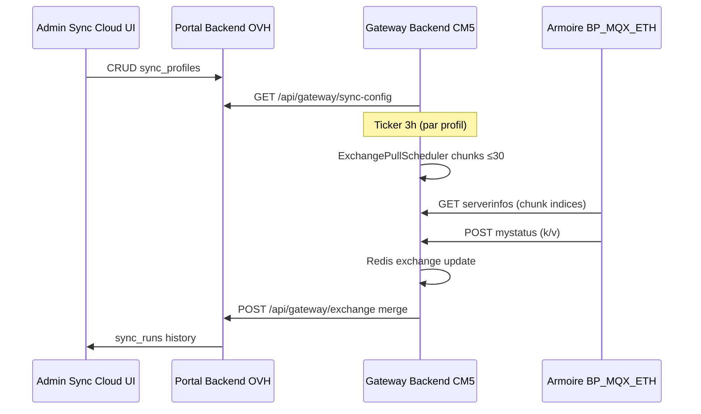

## Context

- **Firmware** BP_MQX_ETH (SC944D 099-37) : max **30 indices** dans `serverinfos` ; cycle Ethernet = `serverinfos → mystatus → myactions → done`.
- **Gateway** : `internal/cloudsync/` poll actions (~5 s) + `pushExchange()` avec liste fixe 13–348, 566–585, etc.
- **Pull manuel** (juin 2026) : `POST /api/admin/heating/sync` + rotation `HeatingSyncManager` — prouvé sur SDB1 (84/84 octets OFF en ~15 s).
- **Cloud** : `gateway_exchange_cache` merge les clés ; portail lit `/api/portal/exchange`.
- **Contrainte absolue** : ne pas casser le cycle armoire ni modifier les signatures des endpoints legacy IoT.

## Goals / Non-Goals

**Goals**

- Sync automatique **toutes les 3 h** par défaut, configurable par plage de ref.
- UI admin pour ajouter / éditer / désactiver des profils sans redeploy Ansible.
- Pull armoire puis push cloud atomique par profil (ou séquentiel par gateway).
- Historique et console visibles côté admin (comme console chauffage LAN).
- Jumeaux UI/API documentés : config admin cloud ; exécution sur gateway.

**Non-Goals**

- Modifier le firmware pour augmenter la limite 30 indices.
- Sync bidirectionnelle cloud → armoire via ce change (reste via `cloud_actions` / inject existant).
- Remplacer le poll 5 s des actions cloud.
- Exposer le menu Sync Cloud aux utilisateurs finaux (portail `/portal/`).

## Decisions

### D1 — Profil de sync = unité de configuration

```json
{
  "id": "uuid",
  "gateway_id": "…",
  "name": "Planning SDB1",
  "index_ranges": [[181, 264]],
  "interval_hours": 3,
  "pull_from_armoire": true,
  "push_to_cloud": true,
  "enabled": true
}
```

**Alternatives** : un seul cron global hardcodé (rejeté — pas assez flexible) ; fichier YAML seul sans UI (rejeté — demande utilisateur).

### D2 — Persistance cloud, cache gateway

**Choix** : source de vérité PostgreSQL (`sync_profiles`) sur OVH ; gateway reçoit la config via `GET /api/gateway/sync-config` à chaque poll cloudsync (ou webhook long-poll).

**Alternatives** : config 100 % locale gateway (rejeté — admin centralisé demandé) ; Redis seul (rejeté — pas d'UI admin simple).

### D3 — Scheduler : ticker dans l'agent cloudsync

**Choix** : goroutine dédiée dans `essensys-server-backend/internal/cloudsync/`, vérifie `next_run_at` par profil ; défaut **3 h** si non spécifié.

**Alternatives** : cron systemd externe (acceptable en fallback Ansible) ; Kubernetes CronJob (hors scope CM5).

### D4 — Pull = généralisation de HeatingSyncManager

**Choix** : renommer / étendre en `ExchangePullScheduler` — file d'attente de chunks ≤30 indices, exclusive lock (un seul pull à la fois pour ne pas perturber le cycle armoire).

Pendant un pull planifié, `GetServerInfos` sert le chunk courant (comportement identique sync chauffage manuelle).

**Alternatives** : requête MQTT parallèle (non disponible firmware) ; lecture flash directe (impossible via HTTP legacy).

### D5 — Push = sous-ensemble des profils

**Choix** : après pull réussi, `pushExchange` n'envoie que les clés des profils `push_to_cloud: true` exécutés dans le run (merge cloud inchangé).

Fallback : si aucun profil configuré, conserver `exchangePushIndices()` actuel pour rétrocompatibilité.

### D6 — Menu admin dans essensys-support-site

**Choix** : onglet **Sync Cloud** dans `Admin.jsx` (rôle `admin_global`), pages :
- liste profils filtrable par gateway ;
- formulaire plages + intervalle ;
- bouton « Sync now » → `POST /api/admin/sync-profiles/{id}/run` ;
- panneau logs (dernier run + SSE ou polling).

**Alternatives** : page dans portail frontend utilisateur (rejeté) ; Grafana only (rejeté).

### D7 — Intervalle exprimé en heures + validation

**Choix** : `interval_hours` entier ≥ 1, défaut **3** ; conversion interne en `time.Duration` ; affichage « Prochaine sync : … ».

Option future : expression cron (`0 */3 * * *`) en v2.

## Architecture



## Risks / Trade-offs

| Risque | Mitigation |
|--------|------------|
| Pull planifié bloque cycle armoire ~1 min/profil | Mutex pull ; max 1 profil à la fois ; fenêtre creuse possible |
| serverinfos temporairement sans volets | Pull séquentiel ; durée courte ; logs warning |
| Config admin incorrecte (>336 indices) | Validation API + UI |
| Gateway offline | Runs en échec ; retry next interval ; alerte admin |
| Divergence LAN vs cloud | `sync_runs.received_count` vs `expected_count` |

## Migration Plan

1. Migration SQL `sync_profiles`, `sync_runs`.
2. API admin + gateway sync-config.
3. Scheduler gateway + generalisation pull.
4. UI Sync Cloud + profils défaut (seed 3 h).
5. Déploiement OVH + gateway pilote ; doc wiki + versions.md.
6. Désactiver progressivement liste hardcodée si profils seed OK.

## Rollback

- Désactiver tous les profils (`enabled=false`) → retour push hardcodé.
- Feature flag `CLOUDSYNC_SCHEDULED_PULL=false` dans config gateway.
