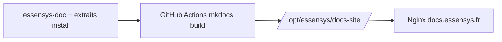

## Context

| Couche | Rôle actuel | Publication |
|--------|-------------|-------------|
| `essensys-doc` | Architecture C4, hardware | GitHub Markdown |
| `essensys-raspberry-install` | Install Pi | GitHub Pages (mike) |
| `essensys-ansible` | Deploy OVH / gateway | gh-deploy |
| `essensys-memory` | Brain agents | Vault Obsidian |
| OVH VPS | SPA + API + `/portal/` | Nginx `mon.essensys.fr` |

## Décisions

1. **Générateur MVP** : **MkDocs Material + mike** — même stack que `essensys-raspberry-install`, build léger, pas de Node en prod.
2. **Hébergement** : fichiers statiques dans `/opt/essensys/docs-site/`, servis par **Nginx** sur le VPS OVH (pas de conteneur dédié).
3. **URL recommandée** : **`docs.essensys.fr`** — évite collision `/api/`, `/portal/` ; cert Let's Encrypt via playbook existant.
4. **Contenu public** (nav MkDocs) :
   - Vue d'ensemble (`essensys-doc/README`, `archi/index` allégé)
   - Install gateway CM5 (extrait `install-gateway.md`)
   - HTTPS `.local` / iPad (`guide-utilisateur-https-local.md`)
   - Install Raspberry (symlink ou include `raspberry-install/docs/`)
   - Niveau installateur : table d'échange résumée — **pas** détail firmware MQX en page d'accueil
5. **Sources canoniques** restent dans les dépôts ; le site = **facade** ; le brain **indexe** (rules doc existantes).
6. **Pipeline** : GitHub Action build artifact → Ansible `docs_site` sur `support-site.yml` (préféré vs build sur VPS).
7. **Doc admin** (`essensys-support-site/docs/`) : hors scope — pas mélangée au hub public sans auth.

## Architecture

## Alternatives repoussées

| Option | Verdict |
|--------|---------|
| Docusaurus + thème custom | Later — parité React dashboard |
| GitHub Pages seul | Ne répond pas au besoin OVH / même domaine trust |
| Doc intégrée SPA React | Double maintenance, mauvais SEO doc |

## Dépendances

- Phase 0 doc/install **completed**
- DNS + cert `docs.essensys.fr` sur inventaire Ansible OVH
