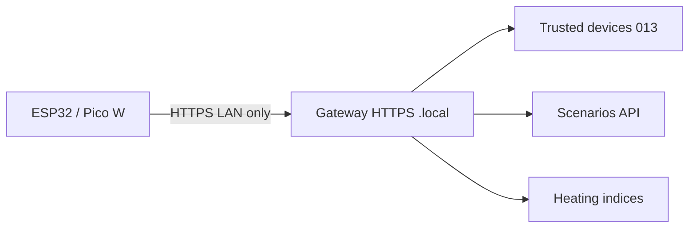

## Context

| Acteur | Besoin |
|--------|--------|
| Utilisateur | Bouton physique « Soirée », « Départ », « Boost chauffage » |
| Installateur | Flasher ESP32/Pico, lier à la gateway `.local` |
| Gateway | Authentifier MCU, exécuter scénario ou écrire indices chauffage |

**Contrainte absolue** : trafic MCU ↔ gateway **uniquement sur le LAN** (mDNS `mon.essensys.local` ou IP privée). Pas d'endpoint public, pas de tunnel cloud.

## Décisions (proposition)

1. **Plateformes MVP** : ESP32 (WiFi) et **Pico W** (WiFi) — GPIO boutons + LED feedback optionnelle.
2. **Transport** : HTTPS vers API gateway LAN (`https://mon.essensys.local/api/...`) avec token **device-bound** issu de l'enrôlement 013 — pas de Basic Auth partagé.
3. **Enrôlement** : flux admin « Ajouter panneau MCU » → QR ou code court → firmware provisionné ; device ID dans registre trusted devices.
4. **Mapping** :
   - Type **scenario** : `POST /api/mcu/button/{id}/press` → `launch` scénario existant (même sémantique que UI).
   - Type **heating** : action prédéfinie (ex. mode confort, off, boost 1 h) via indices table d'échange documentés — pas d'éditeur planning sur MCU.
5. **Sécurité** :
   - Certificat gateway `.local` (CA locale / Traefik) — MCU stocke fingerprint ou cert pinning.
   - Rate limit par device ; révocation immédiate côté admin.
   - Requêtes depuis IP non-RFC1918 **rejetées** (middleware backend).
6. **Firmware** : dépôt ou dossier `essensys-board-mcu-lan/` — sketches PlatformIO (ESP32) + Pico SDK ; config via NVS/flash (gateway host, device token, button count).
7. **UI** : page « Panneaux MCU » dans dashboard local — liste devices, assignation bouton N → scénario ou action chauffage.

## Architecture

## Dépendances

- **2026-06.013** — trusted devices (enrollment, session device, HTTPS local)
- **2026-06.006** — scénarios stables (launch API)
- Optionnel : **2026-06.009** mTLS pour durcir TLS LAN (non bloquant MVP si pinning suffit)

## Alternatives repoussées

| Option | Verdict |
|--------|---------|
| MQTT direct firmware → Mosquitto | Bypass auth 013 ; surface d'attaque plus large |
| BLE provisioning | Plus complexe ; WiFi LAN suffit pour MVP |
| Contrôle via cloud /portal | Hors scope — LAN only |
