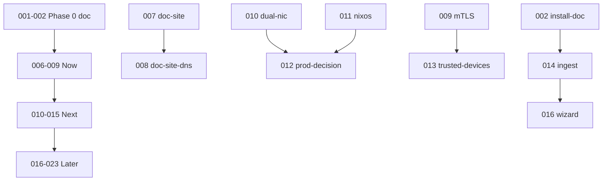

## Context

23 epics produit juin 2026 : Phase 0 done, Now = scénarios + mTLS + doc DNS, Next = trusted devices + prod CM5, Later = wizard + IAM + fleet.

## Décisions

1. **Format ID** : `2026-06.NNN` (NNN = 001..023, zéro-padded).
2. **Dossier nouveau change** : `essensys-{slug}-2026-06.NNN` pour les scaffolds planned uniquement.
3. **Changes legacy** : conserver le nom de dossier ; `roadmap_id` dans `.openspec.yaml`.
4. **Dépôt hôte** : memory par défaut ; backend/front/ansible/raspberry-gateway selon epic.

## Dépendances clés

