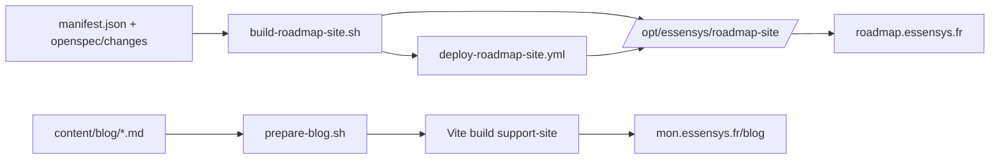

## Context

| Surface | Rôle | URL cible |
|---------|------|-----------|
| Brain + OpenSpec | Source de vérité | `essensys-memory` |
| Doc publique | Guides install/archi | `mon.essensys.fr/docs/` (007) |
| Support SPA | Vitrine + portail | `mon.essensys.fr` |
| **Roadmap site** | Vue publique changes | **`roadmap.essensys.fr`** |
| **Blog** | Avancement epics | **`mon.essensys.fr/blog`** |

## Décisions

1. **Générateur roadmap** : MkDocs Material + script Python `build-roadmap-site.py` lisant `manifest.json` et parcourant `openspec/changes/*/`.
2. **Statuts** : dérivés de `tasks.md` (même heuristique que `update-roadmap.sh`) — `completed` / `active` / `planned`.
3. **Sections publiques** : En cours (active), Terminés (completed), À venir (planned) — tri par `roadmap_id`.
4. **Blog** : Markdown avec frontmatter dans `content/blog/` ; build copie vers `essensys-support-site/site/public/blog/` ; rendu React léger (pas de CMS).
5. **Captures** : MCP **Chrome DevTools** → `raw/assets/roadmap-blog/` ; référencées dans frontmatter blog.
6. **Sync agent** : rule `essensys-roadmap-site.mdc` — à chaque exec queue OpenSpec (`publish-roadmap-public.sh`) et modification visible user → https://roadmap.essensys.fr + https://mon.essensys.fr/blog.
7. **Deploy roadmap (Ansible)** : rôle `roadmap_site` — miroir `docs_site` :
   - **Playbook** : `essensys-ansible/deploy-roadmap-site.yml`
   - **Rôle** : `roles/roadmap_site/` (`defaults`, `tasks/main.yml`, `templates/essensys-roadmap.conf.j2`, `handlers`)
   - **Chemins VPS** : build `/opt/essensys/roadmap-build/essensys-memory`, publish `/opt/essensys/roadmap-site/`
   - **Domaine** : `roadmap_site_domain: roadmap.essensys.fr`
   - **Build on-host** : clone `essensys-memory` → venv Python si MkDocs → `scripts/build-roadmap-site.sh` → `copy` vers `roadmap_site_root`
   - **Nginx** : vhost dédié `essensys-roadmap` (pas de collision `mon.essensys.fr`)
   - **TLS** : certbot webroot `/var/www/certbot`, même pattern que `docs_site` (`failed_when: false` si NXDOMAIN)
   - **Blog** : rôle `frontend` dans le même playbook (rebuild SPA avec `public/blog/` issu de `prepare-blog.sh`)
8. **DNS** : enregistrement `roadmap.essensys.fr` → VPS OVH (prérequis HTTPS ; HTTP seul acceptable en dev)
9. **Intégration support-site.yml** : variable `roadmap_site_enabled: false` par défaut ; activer après validation playbook dédié

## Architecture



## Ansible — inventaire cible

| Variable | Défaut | Description |
|----------|--------|-------------|
| `roadmap_site_enabled` | `true` | Active le rôle |
| `roadmap_site_domain` | `roadmap.essensys.fr` | `server_name` Nginx |
| `roadmap_site_root` | `/opt/essensys/roadmap-site` | Racine fichiers statiques |
| `roadmap_site_repo` | `https://github.com/essensys-hub/essensys-memory.git` | Source OpenSpec |
| `roadmap_site_repo_version` | `main` | Branche/tag build |
| `roadmap_site_build_dir` | `/opt/essensys/roadmap-build` | Clone + venv temporaire |

## Playbook `deploy-roadmap-site.yml`

```yaml
---
- name: Deploy roadmap site and support frontend (blog)
  hosts: essensys
  become: yes
  roles:
    - roadmap_site
    - frontend

- import_playbook: enable-https-prod.yml
```

```bash
cd essensys-ansible
ansible-playbook deploy-roadmap-site.yml -i inventory/ovh
curl -sI https://roadmap.essensys.fr | head -1
```

## Rôle `roadmap_site` — tâches (miroir `docs_site`)

1. `apt` : `python3-pip`, `python3-venv`, `rsync`, `git`
2. `git` : clone `essensys-memory` → `{{ roadmap_site_build_dir }}/essensys-memory`
3. `pip` : venv + `mkdocs-material` (Phase 2 MkDocs)
4. `shell` : `scripts/build-roadmap-site.sh`
5. `file` : `roadmap_site_root` mode `0755`, owner `essensys`
6. `copy` : output build → `roadmap_site_root/`
7. `file` : traverse `/opt/essensys` pour nginx
8. `certbot certonly --webroot` pour `roadmap_site_domain`
9. `template` : `essensys-roadmap.conf.j2` → `sites-available/essensys-roadmap`
10. `notify` : `Reload nginx`

Template Nginx : reprendre `roles/docs_site/templates/essensys-docs.conf.j2` (`roadmap_site_*`).

## Blog — deploy via rôle `frontend`

Pas de vhost blog séparé :

1. `prepare-blog.sh` avant build frontend
2. Rôle `frontend` rebuild SPA (`public/blog/` inclus)
3. Route React `/blog` — Nginx `mon.essensys.fr` inchangé (SPA fallback)

## CI (Phase 2 — préféré post-MVP)

Workflow `essensys-memory/.github/workflows/roadmap-site.yml` : artifact tarball ; Ansible `roadmap_site_use_ci_artifact: true` pour skip build VPS.

## Contenu blog — critère « significatif »

| Oui | Non |
|-----|-----|
| Epic Now/Next passe active | Scaffold planned seul |
| Epic completed | Fix typo doc interne |
| Deploy prod démontrable | Refactor sans impact user |

## Alternatives repoussées

| Option | Verdict |
|--------|---------|
| GitHub Projects public | Pas de descriptions OpenSpec ni blog intégré |
| Notion / CMS externe | Drift vs git, pas de CI |
| Roadmap dans MkDocs doc-site | Mélange audiences doc vs roadmap produit |

## Dépendances

- **004** living roadmap + queue 2026-06 (pattern deploy statique : voir aussi change 007 doc-site comme reference technique)
