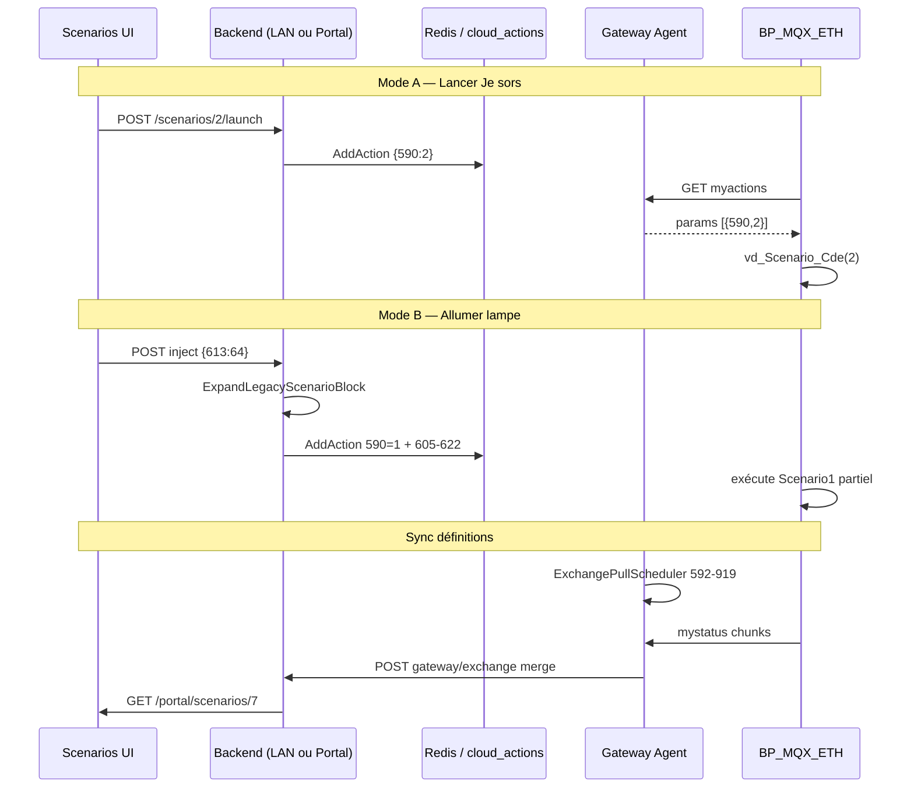

## Context

- **Firmware** BP_MQX_ETH SC944D 099-37 : 8 slots scénario (`Scenario1`–`Scenario8`), chacun **41 octets** (`Scenario_NB_VALEURS`), indices absolus **592–919** ; trigger **590** (`Scenario`) ; dernier lancé **591**.
- **Exécution firmware** : `vd_GestionScenario()` lit `Tb_Echange[590]`, appelle `vd_Scenario_Cde(N)` qui charge le slot `ScenarioN` et exécute masques alarme/lumières/volets/chauffage/cumulus/réveil (`Scenario.c`).
- **Backend actuel** : `ActionService.GenerateCompleteBlock` et `ExpandLegacyScenarioBlock` ne couvrent que **590=1 + 605–622** (Mode B partiel — lumières/volets immédiats). MCP documente Mode A (`590=2..8`) sans UI.
- **Sync cloud** (`essensys-cloud-sync-scheduler`) : profils pull/push par plages ; push fallback hardcodé inclut 590, 605–622 mais **pas** Scenario2–8 ni 623–632.
- **Contrainte absolue** : firmware et endpoints legacy IoT inchangés ; max **30 params/action** (`MaxParamsPerFirmwareAction`).

## Goals / Non-Goals

**Goals**

- Boutons scénarios (Je sors, vacances, …) en UI locale et portail cloud.
- Éditeur structuré des 41 paramètres par slot (2–8 éditables ; slot 1 = serveur).
- Sync cloud des définitions scénario via profil `scenarios` (592–919).
- Cartographie protocole validée firmware + correction wiki/raw.
- Parité jumeaux `essensys-server-*` ↔ `essensys-user-portal-*`.

**Non-Goals**

- Modifier firmware BP_MQX_ETH ou BA.
- Scénarios multi-étapes avec délais (modèle simulation).
- Programmation horaire chauffage (181–264) — change distinct.
- Édition temps de volet (566–589) dans MVP éditeur.
- Menu admin Sync Cloud (déjà livré) — seulement seed profil scénarios.

## Decisions

### D1 — Deux modes d'exécution distincts (firmware)

| Mode | Inject | Usage |
|------|--------|-------|
| **A — Mémorisé** | `{590: "N"}` où N=2..8 | Boutons Je sors, vacances, Perso |
| **B — Serveur** | `{590: "1"}` + bloc indices | Actions lumières/volets immédiates (existant) |

**Alternatives** : toujours envoyer bloc 605–622 avec boutons (rejeté — redondant, risque écrasement état) ; réécrire slot entier avant lancement Mode A (rejeté — lenteur, 41 indices).

### D2 — Package domain `scenario` partagé (library-first)

**Choix** : logique métier dans `essensys-server-backend/internal/scenario/` ; copie ou extraction vers `essensys-user-portal-backend/internal/domain/scenario/` (même structs, tests miroir).

Fonctions clés :
- `LaunchParams(slot int) []ExchangeKV`
- `SlotBaseIndex(slot int) int` — Scenario1=592, ScenarioN=592+(N-1)*41
- `ValidateDefinition(slot int, params map[int]string) error`
- `ExpandModeB(params []ExchangeKV, full bool)` — full=false → 605–622 ; full=true → 592–632

**Alternatives** : package Go partagé `essensys-protocol` (reporté — scope trop large pour ce change).

### D3 — Écriture définition scénario : batch inject ordonné

Écrire 41 indices dépasse la limite 30 params/action firmware.

**Choix** : séquencer **2 actions** par slot :
1. Action 1 : indices base..base+29 (30 params, **sans** 590)
2. Action 2 : indices base+30..base+40 + option `{590: "1"}` si test immédiat slot 1 uniquement

Pour slots 2–8, écriture sans trigger 590 (définition seule) ; lancement séparé via Mode A.

**Alternatives** : une action par indice (rejeté — latence file Redis) ; mystatus direct sans myactions (impossible — serveur pousse via myactions).

### D4 — Modèle cloud `scenario_definitions`

```sql
scenario_definitions (
  id UUID PRIMARY KEY,
  gateway_id TEXT NOT NULL,
  slot_number SMALLINT NOT NULL CHECK (slot_number BETWEEN 1 AND 8),
  label TEXT NOT NULL,
  preset_type TEXT,  -- je_sors | vacances | custom | ...
  params JSONB NOT NULL,  -- {"592":"0","593":"1",...} clés string
  updated_at TIMESTAMPTZ,
  updated_by UUID,
  UNIQUE (gateway_id, slot_number)
)
```

**Source de vérité runtime** : cache exchange Redis (gateway) + `gateway_exchange_cache` (cloud). PG stocke la **définition logique** éditée par l'utilisateur ; resync après pull armoire.

**Alternatives** : PG seul sans cache (rejeté — portail lit exchange cache) ; fichiers YAML gateway (rejeté — pas d'édition cloud).

### D5 — Profil sync `scenarios`

**Choix** : seed profil par défaut :

| name | index_ranges | interval_hours |
|------|--------------|----------------|
| Scénarios | [[592, 919]] | 3 |

Pull en **11 chunks** de 30 (dernier 8). **Exclure 590** du push continu (firmware remet à 0 après exécution). Inclure **591** (dernier lancé) en lecture seule côté UI.

**Alternatives** : 8 profils par slot (rejeté — overhead scheduler) ; sync 590 (rejeté — bruit).

### D6 — UI : page `/scenarios` jumelle

**Choix** :
- **Dashboard** : 7 boutons visibles (slots 2–8) + slot 1 masqué ou « Actions serveur » info.
- **Éditeur** : drawer/modal par slot ; onglets Alarme / Lumières / Volets / Chauffage / Cumulus / Réveil.
- **Bitmasks** : charger labels depuis `table_reference.json` (HA) ou fichier statique généré Phase 0.

Composants partagés : `ScenarioButtonGrid`, `ScenarioEditorDrawer`, hook `useScenarios()`.

**Alternatives** : une page par slot (rejeté — UX lourde).

### D7 — API routes

| Contexte | Prefix | Exemple |
|----------|--------|---------|
| LAN admin/user | `/api/scenarios` | `POST /api/scenarios/2/launch` |
| Portail cloud | `/api/portal/scenarios` | même sémantique, JWT + link approuvé |

Handlers appellent `ActionService.AddAction()` (LAN) ou `cloud_actions` enqueue (portail).

### D8 — Documentation

**Choix** : corriger `essensys-memory/raw/protocol/exchange-table.md` via script sync documenté (exception explicite à la règle raw immuable — entrée changelog brain). Wiki `wiki/concepts/scenarios-domotique.md` + lien [[Table D Echange]].

## Architecture



## Risks / Trade-offs

| Risque | Mitigation |
|--------|------------|
| Limite 30 params/action pour écriture slot complet | Batch 2 actions ordonnées (D3) ; tests E2E |
| Doc raw base 600 vs 592 | Phase 0 audit obligatoire ; errata déjà dans essensys-doc |
| Push 590 pollue sync | Exclure 590 du push ; inclure 591 seulement |
| Divergence LAN vs cloud après édition | Pull après push ; horodatage `updated_at` |
| Variante firmware non 099-37 | Documenter référence SC944D ; indices calculés depuis TableEchange.h par install |
| Éditeur trop complexe (41 champs) | MVP onglets prioritaires : lumières + volets ; alarme/chauffage phase 2 UI |

## Migration Plan

1. Phase 0 : audit indices + correction doc.
2. Package `scenario` + tests backend.
3. Migration PG `scenario_definitions` + seed profil sync.
4. API LAN puis portail.
5. UI jumelles dashboard + éditeur MVP.
6. Extension push/pull gateway ; Settings toggle sync scénarios.
7. E2E pilote CM5 + déploiement OVH ; wiki + versions.md.

## Rollback

- Feature flag `scenarios.enabled: false` dans config gateway et portail.
- Désactiver profil sync `scenarios` (`enabled=false`).
- UI masquée par route guard ; APIs retournent 404 si flag off.

## Open Questions

- **OQ1** : Slot 1 éditable depuis UI ou lecture seule (réservé serveur) ? → MVP : lecture seule, édition slots 2–8 + Perso.
- **OQ2** : Confirmation écran firmware (`Scenario_Confirme`) — forcer à 0 depuis serveur ? → MVP : écrire 0 pour bypass confirmation distante.
- **OQ3** : Package Go partagé inter-repos — extraire en v2 si duplication jumelle devient pénible.
