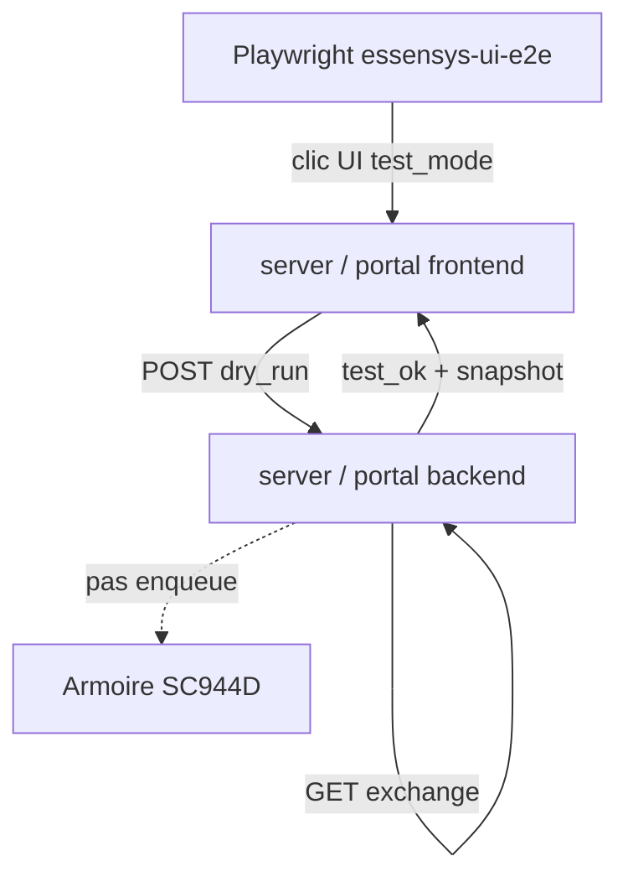

## Context

| Surface | URL type | Écritures aujourd'hui | Lecture |
|---------|----------|----------------------|---------|
| **local** | `https://mon.essensys.local/` | `POST /api/admin/inject`, `/api/scenarios/*/launch` → **file firmware** | `GET /api/admin/exchange` |
| **remote** | `https://mon.essensys.fr/portal/` | `POST /api/portal/inject`, `/api/portal/scenarios/*/launch` → hub → gateway | `GET /api/portal/exchange` |
| **demo** | `https://demo.essensys.fr/` | Mocks `mockFetch` — pas d'armoire | Mocks JSON |

**Problème** : Playwright qui clique « Lancer scénario » ou « Enregistrer chauffage » sur **local** ou **remote** envoie de vraies commandes à l'armoire.

**Objectif mode test** : même parcours UI, mais le backend **valide et retourne un rapport** sans `AddActions` / sans forward gateway.

## Décisions (proposition)

### 1. Activation mode test

| Canal | Mécanisme |
|-------|-----------|
| API | Header `X-Essensys-Test-Mode: dry-run` **ou** query `?test_mode=dry_run` sur POST/PUT concernés |
| UI | Toggle « Mode test » (Settings ou query `?test=1`) → header injecté par `legacyApi` / `portalApi` |
| CI Playwright | Variable `ESSENSYS_TEST_MODE=dry_run` (défaut **on** sauf suite explicitement « live ») |

Refus si header absent sur environnement marqué `production_client` (config gateway) — hors scope MVP.

### 2. Comportement dry-run (backend local)

Pour `POST /api/admin/inject`, `POST /api/scenarios/{n}/launch`, `PUT /api/scenarios/{n}`, `POST /api/web/actions` :

1. Parser et valider payload (indices, ≤30 params, slots autorisés).
2. **Ne pas** appeler `actionService.AddActions` ni enqueue cloud.
3. Répondre `200` avec corps :

```json
{
  "status": "test_ok",
  "dry_run": true,
  "validated_params": [{"k": 590, "v": "2"}],
  "exchange_snapshot": [{"k": 349, "v": "1"}],
  "message": "Validation OK — non envoyé à l'armoire"
}
```

En cas d'échec validation : `422` + `status: "test_failed"` + détails.

4. **Lecture exchange** : `GET /api/admin/exchange?keys=...` inchangé — compare **valeurs déjà reçues** du firmware (`mystatus`) ; le test Playwright asserte `expected` vs `snapshot` **sans** écrire.

### 3. Portail cloud (jumeau)

Même sémantique sur `essensys-user-portal-backend` :

- `POST /api/portal/inject?test_mode=dry_run`
- `POST /api/portal/scenarios/{n}/launch?test_mode=dry_run`
- Pas de forward vers gateway si dry-run.

### 4. Frontend

- Bandeau visible : « Mode test — aucune commande envoyée à l'armoire ».
- Toasts / console injection : afficher `test_ok` / `test_failed` au lieu de « Action envoyée ».
- Parité **server-frontend** et **user-portal-frontend** (rule sync).

### 5. Playwright — matrice cibles

Dossier proposé : `essensys-ui-e2e/` à la racine monorepo (ou `essensys-server-frontend/e2e/` si un seul dépôt git).

```typescript
// playwright.config.ts — projects
projects: [
  { name: 'demo',     use: { baseURL: 'https://demo.essensys.fr' } },
  { name: 'local',    use: { baseURL: process.env.ESSENSYS_LOCAL_URL ?? 'https://mon.essensys.local' } },
  { name: 'remote',   use: { baseURL: process.env.ESSENSYS_PORTAL_URL ?? 'https://mon.essensys.fr/portal' } },
]
```

| Profil | Auth | Écritures | Assertions type |
|--------|------|-----------|-----------------|
| **demo** | Aucune | Mocks | UI visible, navigation, scénarios liste mock |
| **local** | Basic Auth env | dry-run header | Verdict API + exchange read |
| **remote** | JWT `EMAIL`/`JWT_SECRET` | dry-run | Idem portail |

Fixtures partagées : `fixtures/targets.ts`, `fixtures/test-mode.ts`.

### 6. Scénarios E2E MVP (non-régression)

1. Dashboard charge, menu navigation toutes pages.
2. Scénarios : liste slots, ouverture éditeur, **launch dry-run** → `test_ok`.
3. Chauffage : changement mode → dry-run inject batch → validation indices 349–352.
4. Éclairage : bitmask UI → dry-run.
5. (demo) Pas d'appel réseau non mocké — grep console `[MOCK]`.

### 7. CI

- GitHub Actions `essensys-ui-e2e` : `npx playwright test --project=demo` sur chaque PR support-site + server-frontend.
- Workflow manuel `workflow_dispatch` pour local/remote avec secrets.

## Architecture



## Dépendances

- **006** — API scénarios documentées
- **015** — remote UI (recommandé pour profil remote complet)
- Rules `.cursor/rules/portal-server-frontend-sync.mdc` — nouveaux hooks test dans les deux frontends

## Alternatives repoussées

| Option | Verdict |
|--------|---------|
| Playwright uniquement sur demo | Ne couvre pas parité local/remote ni validation exchange réelle |
| Mock MSW côté front sans backend dry-run | Ne valide pas la chaîne API / indices firmware |
| Toujours utiliser file firmware + rollback | Dangereux sur installation client |
