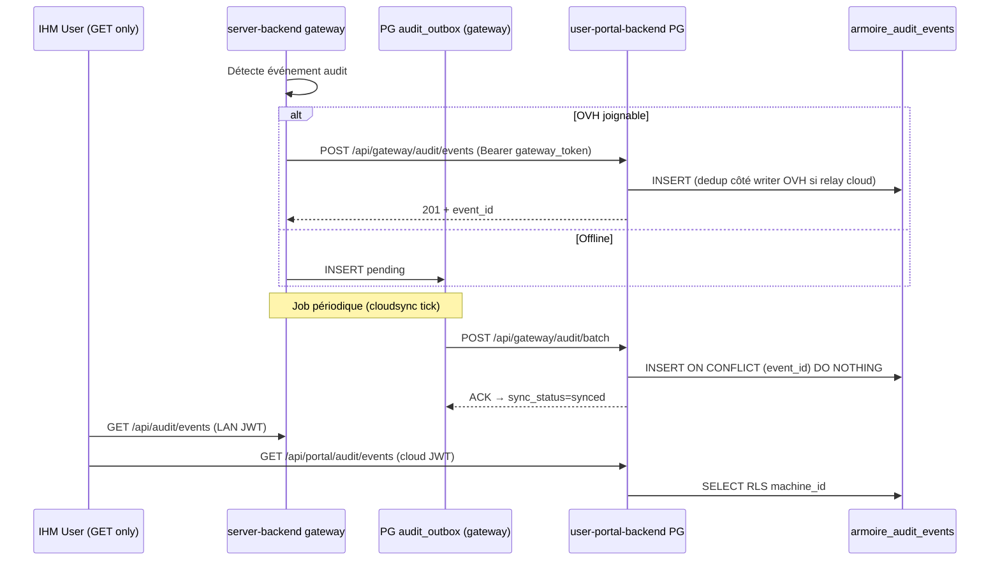

# Prompt : audit trail par armoire — lecture seule, RBAC, sync gateway ↔ OVH

Tu es un ingénieur **full-stack (Go + React/TypeScript) + PostgreSQL + sécurité**. Ta mission est de **concevoir et spécifier** (puis implémenter via OpenSpec) un **journal d'audit par armoire** (`machine_id`) accessible depuis la **gateway locale** (`mon.essensys.local`) et le **portail distant** (`mon.essensys.fr`), en **lecture seule** pour tous les utilisateurs finaux.

Respecte **Clean Architecture / DDD** : bounded context `audit` isolé, writers internes uniquement, **aucune route d'écriture exposée aux JWT utilisateur**. Applique **library-first** : étendre les patterns `cloudsync`, migrations Ansible et RBAC existants avant tout NIH.

**Contrainte absolue** : les **utilisateurs** (cloud ou LAN) ne peuvent **jamais** créer, modifier ou supprimer une entrée d'audit — ni via l'IHM, ni via l'API avec leur token. Seuls les **composants backend** (gateway, hub cloud, workers) écrivent.

---

## 0. Autocritique — ne pas confondre avec l'audit support existant

| Existant | Limite | Ce change |
|----------|--------|-----------|
| `audit_logs` / `portal_audit_log` sur OVH (`essensys-user-portal-backend`) | Auth admin plateforme (login, rôles users cloud) | **Événements domotique + config + états** par `machine_id` |
| `essensys-support-site/docs/audit_trail.md` | User ne voit que **ses** actions | Sur **une armoire liée**, `user` voit **tout** le journal de **cette** armoire |
| `essensys-control-plane` SQLite audit Redis | Ops control-plane local | Hors scope — ne pas mélanger |

**Décision** : nouvelle table canonique `armoire_audit_events` sur **PostgreSQL OVH** ; file d'attente locale sur gateway pour résilience offline (voir §0 bis — **PostgreSQL gateway**, pas SQLite, si LAN IAM actif).

---

## 0 bis. Autocritique croisée (OKF / raw / docs) — 2026-06-30

Relecture du prompt contre `essensys-memory/okf/`, `essensys-memory/raw/`, `essensys-memory/docs/WORKFLOW.md` et le code consolidé. **Corrections à intégrer avant OpenSpec.**

### 0 bis.1 Écarts bloquants

| # | Écart du prompt v1 | Source OKF / raw / code | Correction v2 |
|---|-------------------|-------------------------|---------------|
| **E1** | Audit = gateway + sync obligatoire | [Deployment Perimeters](/okf/processes/deployment-perimeters.md) **périmètre 3 — armoire seule WAN** : firmware poll `mon.essensys.fr` **sans** `server-backend` local | Troisième mode writer : **`internal/legacyiot`** (handlers `mystatus` / `myactions` / inject portail) sur OVH uniquement. Pas d'outbox gateway. UI = portail cloud seulement. |
| **E2** | `user` cloud voit **tout** le journal armoire | `audit_trail.md` support + `admin/handlers.go` `AuditLogs` : `RoleUser` → `filter.UserID` (actions **personnelles** seulement) | **Décision produit explicite** : changement **breaking** vs audit support actuel. Documenter migration, ne pas étendre `audit_logs` — table séparée `armoire_audit_events`. Mettre à jour `roles_matrix.md` + `audit_trail.md`. |
| **E3** | Lecture utilisateur **toujours depuis OVH** | OKF LAN : autonomie `mon.essensys.local` ; coupure Internet fréquente sur site | **LAN** : `GET /api/audit/events` lit le **cache local** (outbox synced + events récents PG gateway si répliqua) ; **cloud** lit OVH. Définir fenêtre de cohérence (ex. events locaux non sync marqués `pending_sync: true`). |
| **E4** | Buffer **SQLite** `audit_outbox` | OKF [Trusted Devices](/okf/concepts/trusted-devices-lan.md) + raw : **PostgreSQL gateway** déjà déployé pour `lan_users` / `trusted_devices` | Outbox = table `audit_outbox` dans **même PG gateway** (migration `006+`), pas second SQLite. Réserver SQLite au control-plane (hors scope). |
| **E5** | Troisième table audit sans stratégie | raw `essensys-user-portal-backend` : `portal_audit_log` (001) + `audit_logs` (EnsureTableExists identity) | Matrice de coexistence : `audit_logs` = auth plateforme ; `portal_audit_log` = legacy portail ; **`armoire_audit_events`** = domotique. Pas de fusion MVP. Option Phase 2 : vue unifiée admin_global. |

### 0 bis.2 Écarts majeurs (design)

| # | Risque | Détail | Action v2 |
|---|--------|--------|-----------|
| **E6** | Doublons `USER_ACTION` | Cloud relay : inject portail → `cloud_actions` → gateway exécute localement — deux writers potentiels | **Une seule source de vérité par chemin** : event `source=cloud` écrit OVH à l'inject ; gateway logue seulement si action **origine LAN** ou enrichissement `actor` manquant côté cloud. Idempotence clé `(machine_id, action_guid)`. |
| **E7** | Dedup `STATE_CHANGE` naïf | Dual protocol : `mystatus` poll ~2 s, centaines d'indices k/v ([Table d'échange](/okf/protocols/table-d-echange.md)) | Whitelist indices « auditables » (alarme, chauffage, scénario actif, portes…) ; ignorer le bruit télémétrie. Documenter liste dans spec. Ne pas hooker tous les indices Redis. |
| **E8** | Hash chain | Events bufferisés offline : `prev_hash` inconnu jusqu'au sync | Chaîne **par `machine_id`**, calcul **à l'ingest OVH** lors du batch ; gateway envoie `payload` sans hash ; OVH enchaîne. Tests : ordre `occurred_at` vs ordre ingest. |
| **E9** | RBAC LAN `lan_guest` | OKF trusted-devices : `lan_guest` peut piloter (comme `lan_user`) mais prompt l'exclut de l'audit | **Confirmer produit** : exclusion `lan_guest` maintenue (invité ≠ membre du foyer pour journal). Documenter dans spec. |
| **E10** | `linked_armoire_id` | raw user-portal : `users.linked_machine_id`, `linked_gateway_id`, **`linked_armoire_id`** ; `bindArmoireForPortalDelivery` mode armoire seule | Authorizer : résoudre `machine_id` effectif = `linked_machine_id` ?? `linked_armoire_id` pour périmètre 3. |
| **E11** | **CASL + TanStack** absents du code | Grep frontends : pas de `@casl/ability`, pas de TanStack Table | **Alternatives alignées stack** : garde routes + tests RTL ; table read-only maison ou composant existant (pattern `Admin.jsx` support-site). CASL = recommandé, pas imposé si tests abilities équivalents. |
| **E12** | RGPD / vie privée | raw support-site : `privacy_policy.md` ; journal complet visible par tous les `user` du foyer | Phase 0 : mention rétention (ex. 24 mois), base légale, droit d'accès, minimisation IP (`/24` masqué optionnel). Page doc + lien privacy. |
| **E13** | Control-plane `/api/audit` | raw `essensys-control-plane` : audit Redis ops — **pas** journal utilisateur | Hors scope explicite ; pas de lien IHM audit domotique ↔ control-plane. |

### 0 bis.3 Lacunes process (docs/WORKFLOW)

| Lacune | Référence | À ajouter au change |
|--------|-----------|---------------------|
| Jumeaux non détaillés pour audit UI | `docs/WORKFLOW.md` §2 | Tâche explicite sync `AuditTrailPage` server ↔ portal frontend |
| Brain ingest post-merge | `essensys-brain.mdc` | `wiki/concepts/armoire-audit-trail.md` + entrée OKF `okf/concepts/` |
| Feature lifecycle gates | `okf/processes/feature-lifecycle.md` | `feature-gate.yml` + `security-gate.yml` dans DoD |
| Dépendance trusted-devices | `okf/portals/lan-local-portal.md` | `AUTH_EVENT` pour auto-login / appairage / révocation |
| Secrets ingest gateway | `okf/roadmap/essensys-secrets-sops-migration-2026-06-028.md` | Token audit ingest dans SOPS, pas en clair |

### 0 bis.4 Matrice des trois périmètres d'installation (alignée OKF)

Complète la matrice install (`essensys-doc/docs/install/index.md`) — chaque périmètre a un **chemin audit** distinct :

| Périmètre OKF | Writers | Lecture IHM | Buffer offline |
|---------------|---------|-------------|----------------|
| **CM5 / Pi LAN** | `server-backend` + sync → OVH | LAN `GET /api/audit/events` + cloud `GET /api/portal/audit/events` | PG gateway `audit_outbox` |
| **Hub + gateway cloudsync** | Idem + `user-portal-backend` sur inject cloud | Portail + LAN | Idem |
| **Armoire seule WAN** | `legacyiot` sur OVH uniquement | Portail cloud **uniquement** | Aucun (OVH direct) |

### 0 bis.5 Tests manquants dans v1 du prompt

- Parité **legacyiot** : `MyStatus` delta → dedup sur périmètre 3 (sans gateway).
- `bindArmoireForPortalDelivery` + user lié armoire seule → lecture audit autorisée.
- LAN sans WAN : lecture cache local contient events écrits offline.
- Non-régression : `GET /api/admin/audit` (auth plateforme) inchangé.
- Charge : 1 armoire × poll 2 s × N indices whitelist → budget INSERT/heure documenté.

---

## 1. Objectifs produit

### 1.1 Ce qu'on livre

1. **Journal append-only** par armoire : actions utilisateur, modifications de configuration, changements d'état domotique.
2. **IHM lecture seule** : page `/audit` ou `/settings/audit` sur gateway **et** portail (jumeaux frontend).
3. **RBAC** : sur une armoire, seuls **`user`**, **`admin_local`**, **`admin_global`** (cloud) et **`lan_user`**, **`lan_admin`** (LAN) peuvent **lire** ; personne d'autre.
4. **Writers** : `essensys-server-backend`, `essensys-user-portal-backend`, agent `cloudsync` — jamais le navigateur.
5. **Déduplication d'état** : si la valeur d'un état est **identique** au dernier événement stocké pour la même clé, **ne pas** persister.
6. **Sync offline** : si la gateway ne peut pas joindre OVH, buffer local puis **replay idempotent** au retour du service.
7. **Tests unitaires poussés** : dedup, RBAC, sync, intégrité, filtres recherche.
8. **Cas d'usage sécurité** : recherche d'anomalie, réponse à une demande utilisateur, détection d'intrusion.

### 1.2 Non-objectifs MVP

- Édition ou purge d'événements par un admin (même global) — archive séparée hors scope.
- Audit firmware BP_MQX_ETH brut (TCP) — on audite les **effets** côté gateway/cloud.
- Export légal long terme (WORM datacenter) — prévoir extension, pas livrer immudb en MVP.
- Remplacement des logs techniques (Prometheus, nginx access log).

---

## 2. Modèle RBAC proposé

### 2.1 Principes

| Règle | Détail |
|-------|--------|
| **Périmètre** | Toute lecture est filtrée par `machine_id` (armoire) |
| **Écriture** | Rôle technique `audit_ingest` (DB) + routes `/api/gateway/audit/*` (token gateway) + writers internes Go |
| **IHM** | Aucun bouton create/edit/delete ; API GET uniquement pour rôles autorisés |
| **Défense en profondeur** | Middleware Go + **PostgreSQL RLS** + **CASL** frontend (miroir des mêmes règles) |

### 2.2 Matrice lecture (par armoire `M`)

| Rôle | Surface | Lecture audit armoire `M` | Écriture |
|------|---------|---------------------------|----------|
| `admin_global` | Cloud `mon.essensys.fr` | ✅ toutes armoires | ❌ |
| `admin_local` | Cloud | ✅ si `linked_machine_id = M` | ❌ |
| `user` | Cloud | ✅ si `linked_machine_id = M` | ❌ |
| `lan_admin` | LAN `mon.essensys.local` | ✅ armoire locale de la gateway | ❌ |
| `lan_user` | LAN | ✅ armoire locale | ❌ |
| `guest_local` / `lan_guest` | LAN | ❌ | ❌ |
| non lié / pending link | Cloud | ❌ | ❌ |
| `support` | Cloud admin | ⚠️ **option Phase 2** — lecture support ticket lié ; **hors MVP** sauf décision explicite |
| Composants (`gateway`, `cloud-backend`) | Interne | ❌ (pas d'IHM) | ✅ |

> **Clarification produit** : contrairement à l'audit support actuel (user = ses actions seulement), ici un **`user` lié à l'armoire `M` voit l'intégralité du journal de `M`** (transparence foyer / recherche d'intrusion). Les `guest_*` n'ont pas accès.

### 2.3 Mapping IAM LAN ↔ cloud

```text
admin_global     → CanReadAudit(machineID any)
admin_local      → CanReadAudit(machineID == linked_machine_id)
user             → CanReadAudit(machineID == linked_machine_id)
lan_admin        → CanReadAudit(machineID == gateway.machine_id)
lan_user         → CanReadAudit(machineID == gateway.machine_id)
*                → CanWriteAudit() = false   // utilisateurs
service/gateway  → CanWriteAudit() = true    // hors JWT utilisateur
```

Implémenter une interface Go unique `internal/audit/Authorizer` consommée par les deux backends (jumeaux portal/server — voir règles sync).

---

## 3. Solution open source — lecture seule IHM + intégrité

### 3.1 Stack recommandée (MVP)

| Couche | Technologie OSS | Rôle |
|--------|-----------------|------|
| **Stockage canonique** | **PostgreSQL** (OVH existant) | Table append-only `armoire_audit_events` |
| **Buffer offline** | **PostgreSQL gateway** (table `audit_outbox`, même instance que `lan_users`) | File d'attente + statut sync |
| **Politique API** | Middleware Go maison + tests table-driven | Refus systématique POST/PUT/PATCH/DELETE audit pour JWT user |
| **Politique DB** | **PostgreSQL RLS** | `INSERT` réservé au rôle `audit_ingest` ; `SELECT` selon `machine_id` + membership |
| **IHM read-only** | **@casl/ability** + **TanStack Table** | CASL : `can('read', 'ArmoireAudit')` uniquement ; Table sans cellules éditables, sans actions row |
| **Recherche / filtres** | TanStack Table + API query params | date, `event_type`, `actor`, `subject_key`, full-text `details` (PG `tsvector` optionnel Phase 2) |
| **Intégrité append-only** | Trigger PG `BEFORE UPDATE OR DELETE` | Interdit mutation sauf rôle superuser maintenance |
| **Chaîne de hachage (recommandé)** | Colonnes `prev_hash`, `event_hash` (SHA-256) | Détection altération DB ; vérification offline dans tests |

### 3.2 Alternatives évaluées (documenter dans design.md)

| Option | Pour | Contre | Décision MVP |
|--------|------|--------|--------------|
| **immudb** | Preuve d'intégrité forte | Ops supplémentaire sur OVH | Reporter Phase 2 |
| **Cerbos / OpenFGA** | Policies externalisées | Complexité pour 2 backends jumeaux | Middleware Go + RLS suffit ; réévaluer si >10 règles |
| **react-admin** | CRUD rapide | Orienté édition — fight the framework pour read-only | ❌ |
| **AG Grid Enterprise** | Tables riches | Licence | TanStack Table (MIT) |

### 3.3 Garantie lecture seule IHM (checklist implémentation)

1. Routes exposées utilisateur : **`GET /api/audit/events`** (LAN) et **`GET /api/portal/audit/events`** (cloud) uniquement.
2. OpenAPI / contrat : **aucun** verb d'écriture sous `/audit` pour schémas `BearerUserJWT`.
3. CASL : abilities initialisées **sans** `create|update|delete` sur `ArmoireAudit`.
4. Composant React : **pas** de `onSubmit` formulaire ; export CSV = lecture dérivée (GET blob), pas écriture audit.
5. Test E2E : tenter `POST` audit avec JWT user → **403** ; avec gateway token → **202**.

---

## 4. Modèle de données

### 4.1 Table canonique OVH — `armoire_audit_events`

```sql
CREATE TABLE armoire_audit_events (
    id              BIGSERIAL PRIMARY KEY,
    event_id        UUID NOT NULL UNIQUE,          -- idempotence sync gateway
    machine_id      INTEGER NOT NULL REFERENCES machines(id),
    gateway_id      VARCHAR(64),
    occurred_at     TIMESTAMPTZ NOT NULL,
    ingested_at     TIMESTAMPTZ NOT NULL DEFAULT now(),
    event_type      VARCHAR(32) NOT NULL,          -- voir §5
    actor_type      VARCHAR(16) NOT NULL,          -- user|lan_user|system|gateway|cloud
    actor_id        VARCHAR(128),                  -- email, lan_user id, ou service name
    actor_ip        INET,
    subject_type    VARCHAR(32) NOT NULL,          -- exchange_index|scenario|config|auth|...
    subject_key     VARCHAR(128) NOT NULL,         -- ex. "613", "scenario:2", "lan_users:42"
    old_value       TEXT,
    new_value       TEXT,
    details         JSONB,                         -- contexte libre (guid action, user-agent, ...)
    source          VARCHAR(16) NOT NULL,          -- gateway|cloud
    prev_hash       CHAR(64),
    event_hash      CHAR(64) NOT NULL
);

CREATE INDEX idx_audit_machine_time ON armoire_audit_events (machine_id, occurred_at DESC);
CREATE INDEX idx_audit_machine_subject ON armoire_audit_events (machine_id, subject_type, subject_key, occurred_at DESC);
CREATE INDEX idx_audit_event_type ON armoire_audit_events (machine_id, event_type, occurred_at DESC);
```

### 4.2 Buffer gateway — `audit_outbox` (PostgreSQL local)

> Même instance que LAN IAM (`lan_users`). Migration Ansible `lan_iam_migrations.yml` ou fichier dédié `006_audit_outbox.up.sql`.

```sql
CREATE TABLE audit_outbox (
    event_id        UUID PRIMARY KEY,
    payload_json    JSONB NOT NULL,
    created_at      TIMESTAMPTZ NOT NULL DEFAULT now(),
    sync_status     VARCHAR(16) NOT NULL DEFAULT 'pending',  -- pending|synced|failed
    sync_attempts   INTEGER NOT NULL DEFAULT 0,
    last_error      TEXT
);
CREATE INDEX idx_audit_outbox_pending ON audit_outbox (sync_status, created_at)
    WHERE sync_status = 'pending';
```

### 4.3 Déduplication états (règle métier critique)

**S'applique** aux `event_type` : `STATE_CHANGE`, `TELEMETRY_SNAPSHOT` (si implémenté).

**Algorithme** (à tester exhaustivement) :

```text
1. Writer reçoit (machine_id, subject_type, subject_key, new_value)
2. Charger dernier événement STOCKÉ pour cette clé (cache Redis optionnel 60s)
3. Si new_value == old_value du dernier événement → SKIP (ne pas INSERT)
4. Sinon → INSERT avec old_value = dernière new_value connue
```

**Ne pas dédupliquer** : `USER_ACTION`, `CONFIG_CHANGE`, `AUTH_EVENT`, `SECURITY_ALERT` — toujours stocker.

**Edge cases tests obligatoires** :

- Premier état (pas d'historique) → INSERT.
- Oscillation A→B→A → trois événements (A initial, B, A).
- Valeurs équivalentes sémantiques différentes (`"64"` vs `"064"`) → normaliser avant compare.
- Concurrence deux writers → verrou advisory PG ou transaction `SELECT ... FOR UPDATE` sur clé.

---

## 5. Taxonomie des événements

| `event_type` | Déclencheur | Exemple `subject_key` | Dedup ? |
|--------------|-------------|----------------------|---------|
| `USER_ACTION` | Inject / bouton UI / scénario lancé | `exchange:590` | Non |
| `CONFIG_CHANGE` | CRUD scénario, réglages sync, user LAN | `scenario:2`, `settings:cloud_sync` | Non |
| `STATE_CHANGE` | Rotation `mystatus` / changement table d'échange | `exchange:613` | **Oui** |
| `AUTH_EVENT` | Login/logout LAN, trusted device, échec auth | `auth:lan_user:12` | Non |
| `SECURITY_ALERT` | Tentative accès audit refusée, token gateway invalide, rate limit | `security:audit_denied` | Non |
| `SYSTEM` | Redémarrage backend, sync batch, recovery outbox | `system:gateway_restart` | Non |

**Hooks writers** (points d'instrumentation minimum) :

| Composant | Hook |
|-----------|------|
| `essensys-server-backend` | Après `ActionService.AddAction`, après apply inject admin, middleware LAN IAM login, détecteur delta exchange |
| `essensys-user-portal-backend` | Après `POST /api/portal/inject`, approbation link, changement rôle cloud ; **`internal/legacyiot`** si périmètre armoire seule WAN |
| Agent `cloudsync` | Heartbeat sync audit batch (métadonnée `SYSTEM`) |

---

## 6. Architecture sync gateway ↔ OVH



**Règles sync** :

- `event_id` UUID v4 généré **sur la gateway** à la création (source de vérité temporelle `occurred_at` gateway).
- Batch max 500 événements ; backoff exponentiel ; conserver outbox 30 jours après sync.
- Lecture **cloud** : depuis OVH (canonique).
- Lecture **LAN** : depuis `server-backend` (cache local = outbox pending + events déjà ingérés) ; indicateur UI si sync en retard.
- Hash chain : calculée à l'**ingest OVH**, pas sur la gateway.

---

## 7. API (contrat minimal)

### 7.1 Lecture utilisateur

```http
GET /api/portal/audit/events?machine_id=19&from=2026-06-01&to=2026-06-30&event_type=USER_ACTION&limit=50&cursor=...
Authorization: Bearer <user_jwt>
→ 200 { events: [...], next_cursor }
→ 403 si rôle non autorisé ou machine non liée
```

Miroir LAN : `GET /api/audit/events` (cookie session `lan_*`).

**Filtres** : `from`, `to`, `event_type`, `actor_id`, `subject_key`, `q` (recherche texte).

### 7.2 Écriture interne (jamais exposée navigateur user)

```http
POST /api/gateway/audit/events
Authorization: Bearer <gateway_token>
X-Gateway-ID / MAC headers
Body: { event_id, machine_id, occurred_at, event_type, ... }
→ 201 | 409 (duplicate event_id)
```

```http
POST /api/gateway/audit/batch
Body: { events: [...] }
→ 200 { accepted: n, duplicates: m, rejected: k }
```

---

## 8. IHM utilisateur (jumeaux frontend)

> **Objectif :** fonctionnalité **utilisateur** visible (sidebar + paramètres + dashboard), pas une page admin cachée.

### 8.1 Points d'entrée UI

| Zone | Fichier existant | Ajout |
|------|------------------|-------|
| Sidebar | `SidebarMenu.tsx` + `useAdminNavItems` (LAN) | Entrée **Journal d'activité** → `/settings/audit` |
| Paramètres | `SettingsPage.tsx` | `ControlCard` résumé + lien |
| Dashboard | `DashboardPage.tsx` | `CardSummary` accès rapide |
| Route | `App.tsx` | `<Route path="/settings/audit" element={<AuditTrailPage />} />` |

**Visibilité menu** (hook `useAuditNavItems`) :

| Rôle | LAN | Cloud |
|------|-----|-------|
| `lan_user`, `lan_admin` | ✅ | — |
| `user`, `admin_local`, `admin_global` (lié) | — | ✅ |
| `lan_guest`, non lié | ❌ masqué | ❌ masqué |

### 8.2 Composants (structure jumeau)

```
src/
  pages/AuditTrailPage.tsx
  components/Audit/
    AuditEventTable.tsx       # colonnes : date, type, acteur, sujet, détail — read-only
    AuditFiltersBar.tsx       # plage dates, event_type, recherche
    AuditCharterModal.tsx     # charte RGPD + checkbox + Accepter
    AuditEventDetailDrawer.tsx
  hooks/useAuditTrail.ts
  hooks/useAuditCharter.ts
  api/auditApi.ts
```

### 8.3 Maquette fonctionnelle `AuditTrailPage`

```
┌─────────────────────────────────────────────────────────┐
│ ← Paramètres   Journal d'activité domotique             │
│ Journal read-only de votre armoire (24 mois)            │
├─────────────────────────────────────────────────────────┤
│ [Filtres: Du | Au | Type ▼ | Recherche…]  [Export CSV] │
├─────────────────────────────────────────────────────────┤
│ 01/07 22:14  USER_ACTION   nicolas@…  Scénario « Je sors»│
│ 01/07 22:10  STATE_CHANGE  système    Chauffage → 19°C   │
│ …                                                        │
└─────────────────────────────────────────────────────────┘
```

- Clic ligne → drawer détail (JSON `details`, IP masquée `/24`)
- Lignes `pending_sync` → badge ambre (LAN offline)

### 8.4 `AuditCharterModal` (premier accès)

- Texte charte scrollable (ou iframe `/privacy/audit-charter`)
- Case : « J'ai lu et j'accepte la charte du journal d'activité »
- Bouton **Accepter** désactivé tant que case non cochée
- Liens : politique confidentialité, contact support
- Après accept → fermeture modal + chargement tableau

### 8.5 Alignement patterns existants

- Réutiliser `PageHeader`, `ControlCard`, `CardSummary`, `ActionButton` (export)
- Même style que `AccountSettingsPage` / `LanUsersAdminPage` (LAN IAM)
- Portail : même logique que sidebar « Mon compte » côté `useAdminNavItems`

### 8.6 Non-objectifs UI MVP

- Pas d'onglet audit dans admin `essensys-support-site` (reste admin plateforme)
- Pas d'édition / suppression d'événements
- Pas de graphiques analytics (Phase 2)

| Élément | Gateway `essensys-server-frontend` | Portail `essensys-user-portal-frontend` |
|---------|-----------------------------------|----------------------------------------|
| Route | `/settings/audit` | `/settings/audit` |
| API | `/api/audit/*` | `/api/portal/audit/*` |
| Auth gate | `useLanAuth` | JWT session portail |

---

## 9. Tests unitaires obligatoires

### 9.1 Backend Go (table-driven, `go test ./...`)

| Package | Tests |
|---------|-------|
| `internal/audit/dedup` | equal skip, A→B→A, normalisation valeur, concurrence |
| `internal/audit/authorizer` | chaque rôle × machine liée / non liée × LAN/cloud |
| `internal/audit/hashchain` | chaîne valide, rupture détectée |
| `internal/audit/writer` | mock PG ; refuse si user context |
| `internal/audit/sync` | outbox replay, idempotence `event_id`, partial batch failure |
| `internal/api` | GET autorisé ; POST user JWT → 403 |

**Couverture cible** : ≥ **85 %** sur `internal/audit/*`.

### 9.2 Frontend

- Tests CASL : abilities sans `create/update/delete` pour tous rôles lecteurs.
- Test composant : table ne rend pas d'input éditable.
- Mock API : erreur 403 → message « Accès refusé » sans fuite d'événements.

### 9.3 Scénarios sécurité (intégration)

| Scénario | Attendu |
|----------|---------|
| `lan_guest` GET audit | 403 + `SECURITY_ALERT` logué |
| User cloud machine `M1` lit audit `M2` | 403 |
| JWT user POST `/api/gateway/audit/events` | 403 |
| Replay batch même `event_id` | 409/ignore, pas de doublon PG |
| Modification directe SQL row | trigger bloque (test migration) |

---

## 10. Cas d'usage sécurité & exploitation

| Cas | Comment l'audit aide |
|-----|---------------------|
| **Recherche d'anomalie** | Filtre `STATE_CHANGE` + plage horaire ; corréler avec `USER_ACTION` |
| **Demande utilisateur** | « Qui a éteint le chauffage à 22h ? » → `actor_id` + `subject_key` |
| **Intrusion** | Pic `AUTH_EVENT` failed + `USER_ACTION` sans `actor` connu + `SECURITY_ALERT` |
| **Litige foyer** | Journal complet armoire visible par tous `user` liés (transparence) — **charte signée obligatoire** |
| **Support Essensys** | Export CSV read-only par admin_global (hors MVP auto — manuel SQL encadré) |

---

## 10 bis. Conformité RGPD — charte et features

### Charte à faire signer

Document **« Charte — journal d'audit domotique Essensys »** (web + PDF), versionnée.

**Contenu minimum :**
1. **Responsable** : Essensys — `support@essensys.fr`
2. **Données** : identité compte, IP, horodatage, type d'action, indices domotiques modifiés, appareil (MAC trusted device si applicable)
3. **Finalités** : sécurité du foyer, transparence entre occupants, support technique, détection d'intrusion
4. **Base légale** : intérêt légitime + exécution du contrat ; **consentement explicite** pour accéder au journal partagé du foyer
5. **Durée** : 24 mois (purge automatique)
6. **Destinataires** : utilisateurs liés à la même armoire, administrateurs Essensys habilités
7. **Hébergement** : OVH (Union européenne) ; synchronisation depuis gateway locale si installée
8. **Droits** : accès, rectification (profil), portabilité (export), effacement (compte → anonymisation dans le journal), contact DPO
9. **Transparence foyer** : en signant, vous acceptez que les autres utilisateurs liés à l'armoire puissent voir vos actions enregistrées dans le journal

**Moments de signature :**
- Cloud : liaison armoire approuvée **ou** premier accès audit portail
- LAN : premier accès `/settings/audit`

### Features RGPD proposées (MVP vs Phase 2)

| ID | Feature | MVP | Phase 2 |
|----|---------|-----|---------|
| **F1** | Charte signée (modal + API accept) | ✅ | — |
| **F2** | Registre consentements admin | ✅ liste acceptations | Export registre |
| **F3** | Ré-consentement si version charte bump | ✅ | Notification email |
| **F4** | Export droit d'accès (JSON/CSV) | ✅ | Bundle ZIP complet |
| **F5** | Purge automatique 24 mois | ✅ job cron | Rétention par armoire |
| **F6** | Minimisation IP affichage `/24` | ✅ IHM | Opt-out IP complète |
| **F7** | Anonymisation à suppression compte | ✅ | — |
| **F8** | Mise à jour `privacy_policy.md` | ✅ | — |
| **F9** | Registre des traitements (doc interne) | ✅ `essensys-doc` | Audit CNIL-ready |
| **F10** | Opposition au traitement | Doc + contact support | Workflow ticket |
| **F11** | Transparence journal foyer partagé | ✅ dans charte | — |
| **F12** | Sous-traitant OVH / DPA | Doc juridique | — |

**Tables :**
- OVH : `user_audit_charter_acceptances(user_id, charter_version, accepted_at, ip_address)`
- Gateway : `lan_audit_charter_acceptances(lan_user_id, charter_version, accepted_at, ip_address)`

---

## 11. Dépendances & jumeaux

| Dépendance | Change / doc |
|------------|--------------|
| Liaison armoire | `essensys-remote-user-interface` — `linked_machine_id` |
| IAM LAN | `essensys-lan-iam-2026-06.017` — rôles `lan_*` |
| Cloud sync | `essensys-cloud-sync-scheduler` — réutiliser tick agent pour flush outbox |
| Jumeaux backend | `.cursor/rules/portal-server-backend-sync.mdc` |
| Jumeaux frontend | `.cursor/rules/portal-server-frontend-sync.mdc` |
| Brain | Mettre à jour [[Cloud Relay]], [[LAN IAM]], matrice install |

**Repos touchés** :

- `essensys-user-portal-backend` (PG canonique, API portal + gateway ingest)
- `essensys-server-backend` (writers, outbox SQLite, API LAN read)
- `essensys-server-frontend` + `essensys-user-portal-frontend`
- `essensys-ansible` (migration PG, rôle SQLite path, env)
- `essensys-doc` (page sécurité / audit)
- `essensys-memory` (wiki concept `armoire-audit-trail.md`)

---

## 12. Livrables OpenSpec attendus

Créer le change : `essensys-memory/openspec/changes/essensys-armoire-audit-trail-2026-06.034/` (ID à ajuster si collision).

| Artefact | Contenu |
|----------|---------|
| `proposal.md` | Problème, périmètre, non-objectifs |
| `design.md` | RBAC, RLS, dedup, hash chain, choix OSS, sync |
| `specs/armoire-audit-trail/spec.md` | Exigences testables (SHALL) |
| `tasks.md` | Phase 0 doc → schema → writers → API → UI → sync → tests |

### Phases suggérées

1. **Phase 0** — Spec RBAC + schéma PG + politique RLS documentée.
2. **Phase 1** — Package `internal/audit` + migrations + tests dedup/authorizer.
3. **Phase 2** — Writers gateway (actions + state delta) + outbox SQLite.
4. **Phase 3** — Ingest OVH + batch sync + hash chain.
5. **Phase 4** — IHM read-only (CASL + TanStack) jumeaux frontends.
6. **Phase 5** — Tests intégration sécurité + doc `essensys-doc` + brain ingest.

---

## 13. Commande agent (TL;DR)

```text
/openspec-propose essensys-armoire-audit-trail

Lire ce prompt + essensys-support-site/docs/audit_trail.md + essensys-support-site/docs/roles_matrix.md
+ internal/data/audit_store.go (existant cloud) + patterns cloudsync.

Produire change OpenSpec avec :
- RBAC lecture user/admin_local/admin_global/lan_user/lan_admin par machine_id
- écriture services uniquement, IHM read-only (CASL + TanStack Table + GET-only API + PG RLS)
- dedup STATE_CHANGE si valeur inchangée
- PG OVH canonique + PG outbox gateway + sync idempotent
- périmètre armoire seule WAN (writers legacyiot OVH)
- tests unitaires ≥85% internal/audit
```

---

## 14. Critères d'acceptation (Definition of Done)

- [ ] Aucune route HTTP d'écriture audit accessible avec JWT/cookie utilisateur (prouvé par tests).
- [ ] `guest_local` / `lan_guest` → 403 sur GET audit.
- [ ] User lié à `M` voit tous les événements de `M`, pas ceux d'une autre armoire.
- [ ] Déduplication état validée par tests table-driven (≥ 10 cas).
- [ ] Coupure réseau OVH → événements en PG gateway outbox → sync complet sans doublon à la reconnexion.
- [ ] IHM gateway + portail identiques (snapshot test ou checklist jumeaux).
- [ ] Charte RGPD signée obligatoire avant accès audit (cloud + LAN) ; ré-consentement si version bump.
- [ ] `privacy_policy.md` et page `/privacy/audit-charter` publiées.
- [ ] `go test ./...` vert dans les deux backends ; tests frontend audit verts.
