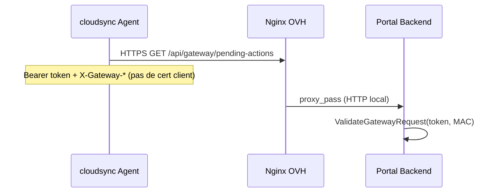

# Gateway PKI

Conception de l’**identité cryptographique** des passerelles CM5 et du lien **gateway ↔ hub cloud** (`mon.essensys.fr`), en complément de [[Gateway Exchange]] et [[Cloud Relay]].

> **État juin 2026** : **HTTPS + Bearer token + triplet MAC** en production. **mTLS client** et **TPM** : cible documentée, **non implémentés** dans le code.

## Problème

Aujourd’hui, une gateway authentifiée sur `/api/gateway/*` présente :

| Élément | Où | Source |
|---------|-----|--------|
| `Authorization: Bearer <gateway_token>` | Header HTTP | `essensys-server-backend/internal/cloudsync/sync.go` (`setGatewayHeaders`) |
| `X-Gateway-ID` | Header HTTP | idem |
| `X-Gateway-Eth0-MAC`, `X-Gateway-Eth1-MAC` | Headers HTTP | idem ; validés côté hub si session enregistrée avec MAC |
| Secret partagé | Ansible vault `cloud_gateway_token`, `config.yaml` | `essensys-ansible/docs/install-gateway.md` |

Validation hub : `GatewayAuth` → `ValidateGatewayRequest` compare `token_hash` et MAC normalisées dans `gateway_sessions` (`essensys-user-portal-backend/internal/data/store.go`, migration `002_gateway_identity.sql`).

**Limites** : token réutilisable si exfiltré ; pas de preuve cryptographique matérielle ; terminaison TLS serveur uniquement (Let's Encrypt WAN).

## État actuel (vérifié)



| Composant | Comportement documenté | Fichier |
|-----------|------------------------|---------|
| Agent sortant | `http.Client` standard, `hub_url` **https://** obligatoire | `internal/cloudsync/sync.go` |
| Hub entrant | Middleware `GatewayAuth`, pas de lecture cert TLS Go | `internal/middleware/auth.go` |
| Proxy OVH | `/api/gateway/` → backend `:8081` (mode dual) | `essensys-ansible/roles/portal_nginx/templates/essensys-portal.conf.j2` |
| mTLS nginx | **Absent** (`ssl_verify_client` non trouvé dans essensys-ansible) | grep repo |
| TPM / go-tpm | **Absent** dans `essensys-raspberry-gateway` | grep repo |

Les contrats legacy firmware (`/api/serverinfos`, `/api/mystatus`, …) **ne sont pas concernés** par cette PKI — segment eth1 HTTP inchangé.

## Cible : identité matérielle + mTLS

### Principes

1. **Clé privée non exportable** — idéalement TPM 2.0 (SPI) sur carrier CM5 ou module équivalent.
2. **Certificat client gateway** — émis par une **CA Essensys** (interne ou ACME gateway dédiée) ; SAN/CN lié à `gateway_id`.
3. **mTLS sur `/api/gateway/*` uniquement** — le portail utilisateur (`/api/portal/*`) et le legacy IoT WAN restent sur JWT / protocole existant.
4. **Bascule progressive** — token Bearer conservé en phase transitoire (double auth).

### Phases de migration

| Phase | Gateway (CM5) | Hub (OVH) | Auth effective |
|-------|---------------|-----------|----------------|
| **0 — Actuel** | Token + MAC en config | `gateway_sessions.token_hash` + MAC | Bearer + headers |
| **1 — Enrollment** | CSR généré (soft ou TPM) ; admin enregistre cert + token | Table `gateway_sessions` + colonne `client_cert_fingerprint` (à créer) | Token (inchangé) + cert stocké |
| **2 — mTLS optionnel** | `tls.Config.GetClientCertificate` dans cloudsync | Nginx `ssl_verify_client optional` sur `location /api/gateway/` ; Go accepte token **ou** cert valide | Token **ou** mTLS |
| **3 — mTLS strict** | Clé TPM uniquement ; rotation cert auto | `ssl_verify_client on` ; retrait obligation token | mTLS + `gateway_id` du cert |

> [!todo] Schéma exact des migrations SQL (`client_cert_fingerprint`, ACME gateway) — non présent dans `essensys-user-portal-backend/migrations/` à ce jour.

## Intégration technique (points d’ancrage)

### Gateway — client HTTP Go

Fichier cible : `essensys-server-backend/internal/cloudsync/sync.go` — constructeur `NewAgent` :

```go
// Cible phase 2+ — non implémenté
transport := &http.Transport{
  TLSClientConfig: &tls.Config{
    GetClientCertificate: func(*tls.CertificateRequestInfo) (*tls.Certificate, error) {
      // charger cert+key depuis TPM (go-tpm) ou fichier enrollé
    },
  },
}
client: &http.Client{Transport: transport, Timeout: 30 * time.Second},
```

> [!todo] Choix **go-tpm** (`crypto.Signer` custom) vs **PKCS#11** (module OpenSSL/p11-kit) — aucune dépendance dans `go.mod` server-backend aujourd’hui.

### Hub — terminaison TLS

**Mode dual-backend** (snippet existant) :

- Fichier : `essensys-ansible/roles/portal_nginx/templates/essensys-portal.conf.j2`
- Bloc : `location /api/gateway/` → `proxy_pass` backend

Ajouts cibles phase 2 :

```nginx
# Exemple cible — non déployé
ssl_client_certificate /etc/ssl/essensys/gateway-ca.pem;
ssl_verify_client optional;  # phase 2 → on en phase 3
```

> [!todo] Emplacement nginx **mode consolidé** (`essensys-cloud-backend` :8080) pour `/api/gateway/` — le rôle `cloud_nginx` ne couvre que le static `/portal/` ; confirmer le vhost principal OVH (playbook support-site / nginx site).

### Hub — validation application

Alternative ou complément nginx :

- Middleware Go lisant `r.TLS.PeerCertificates[0]` et mappant CN/SAN → `gateway_id`.
- Conserver `GatewayAuth` pour compatibilité token pendant phase 2.

### Provisioning

| Étape | Outil | Source actuelle |
|-------|-------|-----------------|
| Enregistrement initial | `POST /api/portal/admin/gateways/register` | `install-gateway.md` |
| Secrets déploiement | Ansible vault | `roles/raspberry_backend/tasks/cloud_sync.yml` |
| Identité dérivée | `gateway_id` ← MAC eth0 (optionnel) | `install-gateway.md` |

Extension cible : endpoint **enroll CSR** → cert signé + fingerprint en base.

## TPM sur CM5

> [!todo] **Matériel** — aucune doc TPM dans [[Essensys Raspberry Gateway]] ni module NixOS TPM dans [[Essensys Gateway Nixos]] (juin 2026).
> [!todo] **Device-tree overlay SPI** pour TPM sur carrier CM5 — à valider avec le schéma carte et `essensys-raspberry-gateway` branche `nixos`.

Recommandation de conception (non validée hardware) :

- Bus **SPI** vers TPM 2.0 (ex. Infineon SLB9670 classique sur designs Pi).
- NixOS : service `tpm2-tools` + unité d’enrollment au first-boot.
- Ansible : chemin parallèle (fichier key en vault) jusqu’à parité NixOS.

## Sécurité et opérations

| Sujet | Actuel | Cible [[Gateway PKI]] |
|-------|--------|------------------------|
| Confidentialité WAN | TLS 1.2+ serveur (LE) | + mTLS client |
| Identité gateway | Token hash + MAC PG | Cert X.509 + fingerprint |
| Révocation | Rotation manuelle token (register) | CRL/OCSP CA + revoke cert |
| Firmware BP | Hors scope | Inchangé (HTTP eth1) |

**Ne pas mélanger** avec JWT utilisateur portail (`JWT_SECRET`) — domaines séparés. La rotation `JWT_SECRET` / `ADMIN_TOKEN` reste un sujet support-site consolidé (hors PKI gateway).

## Liens

- [[Gateway Exchange]] — routes `/api/gateway/*`
- [[Cloud Relay]] — cas d'usage utilisateur
- [[Platform Overview]] — section Sécurité
- [[Essensys Ansible]] — vault et enregistrement gateway
- OpenSpec : [[Essensys Gateway Mtls]] (scaffold)

## Références code

- `essensys-server-backend/internal/cloudsync/sync.go`
- `essensys-user-portal-backend/internal/middleware/auth.go`
- `essensys-user-portal-backend/internal/data/store.go`
- `essensys-user-portal-backend/migrations/001_init.sql`, `002_gateway_identity.sql`
- `essensys-ansible/docs/install-gateway.md`
- `essensys-ansible/roles/portal_nginx/templates/essensys-portal.conf.j2`
