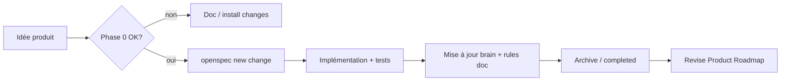

# Product Roadmap Rubric

Rubrique pour **découper les futurs devs** en changes OpenSpec petits, sans conflit avec [[Roadmap OpenSpec]] (index technique auto-sync).

## Trois niveaux

| Niveau | Fichier | Contenu |
|--------|---------|---------|
| **Rubrique** (cette page) | `wiki/roadmap/product-roadmap-rubric.md` | Règles de découpage, ordre des phases, gates |
| **Priorités vivantes** | [[Product Roadmap]] — `wiki/synthesis/product-roadmap.md` | Matrice gap, Now / Next / Later |
| **Exécution technique** | [[Roadmap OpenSpec]] | proposal → design → specs → tasks par change |

## Phase 0 — Fondations

| Ordre | Change OpenSpec | Statut (2026-06-21) | Règle Cursor |
|-------|-----------------|---------------------|--------------|
| **0a** | [[Essensys Centralized Doc Maintenance]] | **completed** | `essensys-centralized-doc.mdc` |
| **0b** | [[Essensys Install Doc Platform]] | **completed** | `essensys-install-doc.mdc` |

**Gate levée** — les epics feature peuvent figurer en **Now** dans [[Product Roadmap]]. Nouveaux devs : toujours appliquer les rules doc/install à chaque PR.

## Phase 1 — Cadre roadmap produit

| Change | Rôle |
|--------|------|
| [[Essensys Product Roadmap]] | Maintient cette rubrique + [[Product Roadmap]] |

Prompt agent : `prompts/roadmap-product.md`

## Phase 2+ — Epics feature (1 change = 1 epic dev)

Chaque ligne **Now** ou **Next** de [[Product Roadmap]] doit pointer vers **un seul** change OpenSpec :

| Critère | Règle |
|---------|--------|
| Taille | Idéal ≤ 2 semaines dev ; sinon decouper |
| Hôte | Dépôt concerné (`essensys-server-backend`, `essensys-memory`, …) |
| Brain | Tâche obligatoire « mettre à jour essensys-memory » dans `tasks.md` |
| Jumeaux | Si domotique UI/API → rules `portal-server-*-sync` |
| Legacy | Ne pas toucher endpoints firmware sans change firmware dédié |

### Changes déjà en cours (ne pas dupliquer)

- [[Essensys Scenario Management]]
- [[Essensys Gateway Mtls]] — [[Gateway PKI]]
- [[Essensys Gateway Dual Nic]], [[Essensys Gateway Nixos]]

### Epics typiques **Later** (créer change au passage en Next)

- Trusted devices (iPad mural, sessions longues)
- Install wizard particulier (`essensys-install-wizard` — à créer)
- IAM LAN / RBAC complet
- Fleet / remote diagnostics

## Workflow dev



## Règles permanentes (tous les devs / agents)

| Règle | Fichier |
|-------|---------|
| Brain | `.cursor/rules/essensys-brain.mdc` |
| Doc centralisée | `.cursor/rules/essensys-centralized-doc.mdc` |
| Doc install | `.cursor/rules/essensys-install-doc.mdc` |
| Jumeaux back | `.cursor/rules/portal-server-backend-sync.mdc` |
| Jumeaux front | `.cursor/rules/portal-server-frontend-sync.mdc` |

## Checklist PR (monorepo)

```markdown
- [ ] Tests passent
- [ ] Jumeaux sync si domotique
- [ ] Doc/brain : essensys-centralized-doc.mdc (+ install si deploy)
- [ ] OpenSpec tasks cochées
- [ ] Product Roadmap : item lié ou N/A
```

## Voir aussi

- [[Platform Overview]]
- [[Migration Legacy To Modern]]
- `essensys-memory/docs/WORKFLOW.md`
